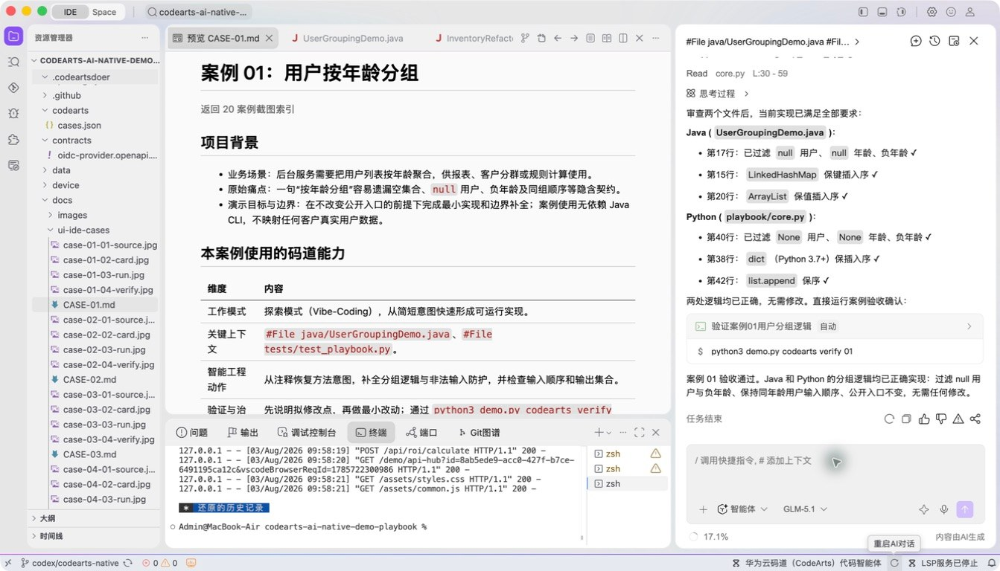
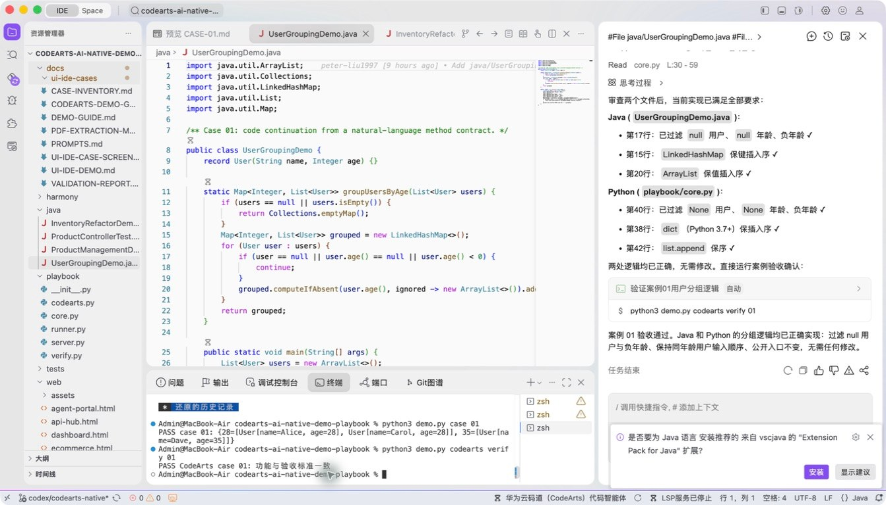

# 案例 01：用户按年龄分组

[返回 20 案例截图索引](../UI-IDE-CASE-SCREENSHOTS.md)

## 项目背景

- 业务场景：后台服务需要把用户列表按年龄聚合，供报表、客户分群或规则计算使用。
- 原始痛点：一句“按年龄分组”容易遗漏空集合、`null` 用户、负年龄及同组顺序等隐含契约。
- 演示目标与边界：在不改变公开入口的前提下完成最小实现和边界补全；案例使用无依赖 Java CLI，不映射任何客户真实用户数据。

## 本案例使用的码道能力

| 维度 | 内容 |
|---|---|
| 工作模式 | 探索模式（Vibe-Coding），从简短意图快速形成可运行实现。 |
| 关键上下文 | `#File java/UserGroupingDemo.java`、`#File tests/test_playbook.py`。 |
| 智能工程动作 | 从注释恢复方法意图，补全分组逻辑与非法输入防护，并检查输入顺序和输出集合。 |
| 验证与治理 | 先说明拟修改点，再做最小改动；通过 `python3 demo.py codearts verify 01` 执行案例级质量门。 |
| 客户价值 | 展示码道如何把“小需求”一次补完整，减少开发者在样板逻辑和边界条件上的往返。 |

本页截图来自本案例独立启动的 CodeArts Agent IDE 操作。主文件：`java/UserGroupingDemo.java`。

## 步骤 1：打开主文件

检查方法契约与混合输入。

## 步骤 2：码道对话与结果

核对 Vibe-Coding、上下文和提示词。 检查码道的上下文读取、分析过程、命令证据和验收结论。

## 步骤 3：实际运行

确认非法用户被过滤且分组结果正确。

## 步骤 4：独立验收

确认案例级验收 PASS。

完成后确认没有遗留案例服务器；Web 案例必须先 `Ctrl+C`，再执行独立验收。
