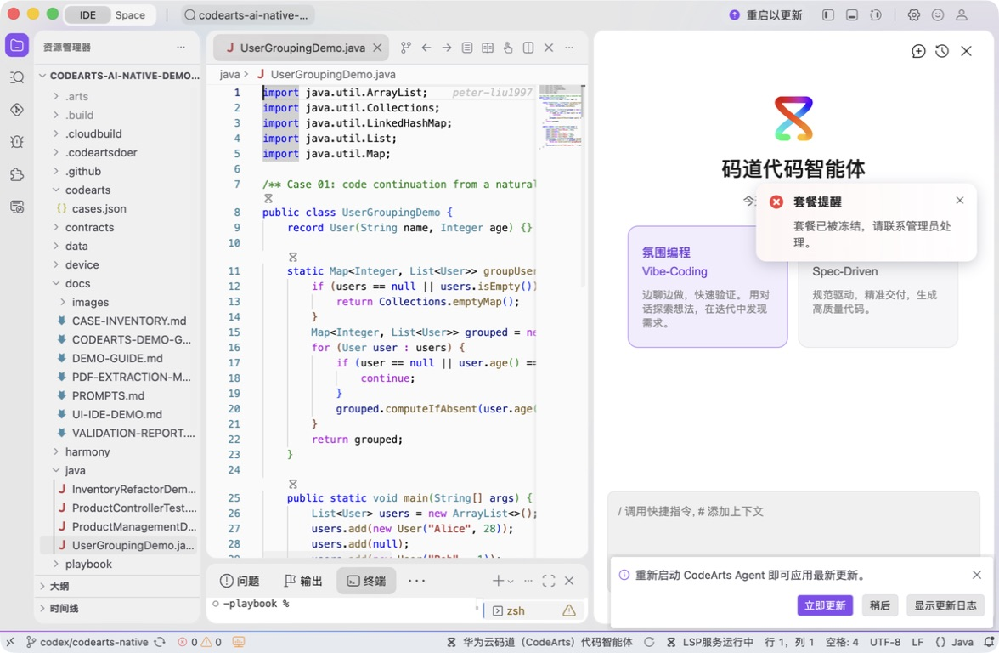
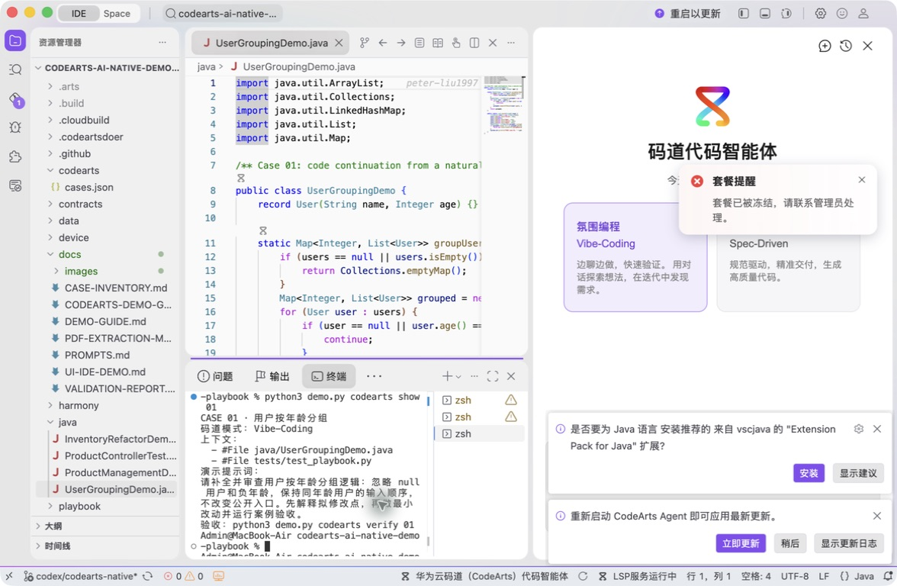

# 案例 01：用户按年龄分组

[返回 20 案例截图索引](../UI-IDE-CASE-SCREENSHOTS.md)

本页截图来自本案例独立启动的 CodeArts Agent IDE 操作。主文件：`java/UserGroupingDemo.java`。

## 步骤 1：打开主文件

检查方法契约与混合输入。

## 步骤 2：码道案例卡

核对 Vibe-Coding、上下文和提示词。

## 步骤 3：实际运行

确认非法用户被过滤且分组结果正确。

## 步骤 4：独立验收

确认案例级验收 PASS。

完成后确认没有遗留案例服务器；Web 案例必须先 `Ctrl+C`，再执行独立验收。

