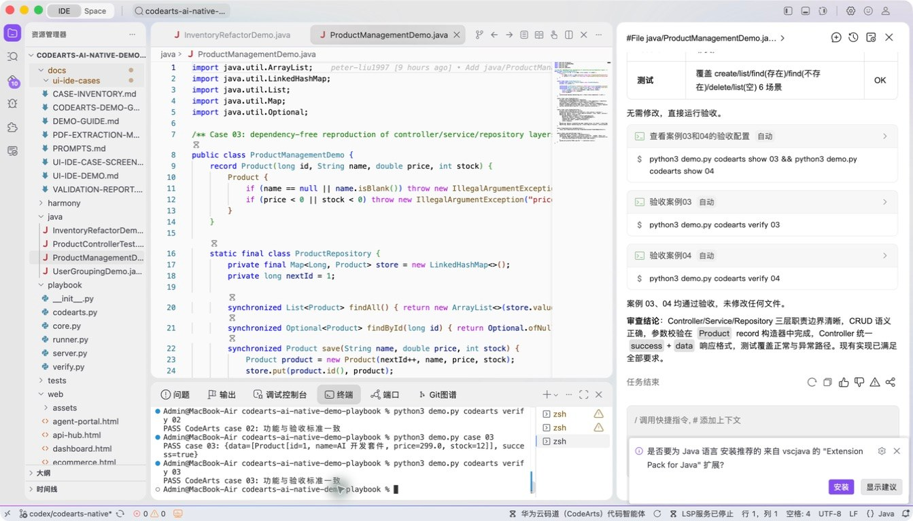

# 案例 03：商品管理项目级生成

[返回 20 案例截图索引](../UI-IDE-CASE-SCREENSHOTS.md)

## 项目背景

- 业务场景：从零搭建一个商品管理模块，需要覆盖模型、服务、控制器和运行入口，而非只生成单个函数。
- 原始痛点：项目级生成常出现职责混杂、跨类调用断裂、接口契约不一致，以及“文件很多但项目跑不起来”。
- 演示目标与边界：使用 Java 标准库构建无外部依赖的分层 CRUD 示例，重点验证多文件协同，不模拟生产数据库。

## 本案例使用的码道能力

| 维度 | 内容 |
|---|---|
| 工作模式 | 探索模式（Vibe-Coding），把业务目标逐步展开成工程结构。 |
| 关键上下文 | `#File java/ProductManagementDemo.java`、`#File java/ProductControllerTest.java`。 |
| 智能工程动作 | 规划类职责，生成跨类调用链，并统一商品 CRUD 的校验、返回值和异常契约。 |
| 验证与治理 | 只创建必要文件，通过主程序和控制器测试双重验证项目能够编译、运行。 |
| 客户价值 | 展示码道从单文件补全走向项目级多文件生成和工程组织的能力。 |

本页截图来自本案例独立启动的 CodeArts Agent IDE 操作。主文件：`java/ProductManagementDemo.java`。

## 步骤 1：打开主文件

查看分层结构入口。

## 步骤 2：码道案例卡

核对多文件生成、架构和 CRUD 上下文。

## 步骤 3：实际运行

查看商品创建和仓库输出。

## 步骤 4：独立验收

确认案例级验收 PASS。

完成后确认没有遗留案例服务器；Web 案例必须先 `Ctrl+C`，再执行独立验收。
