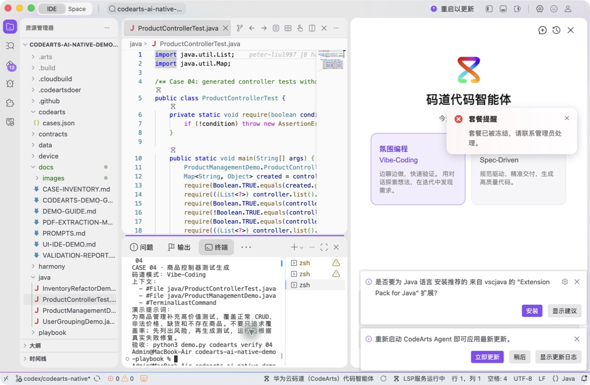
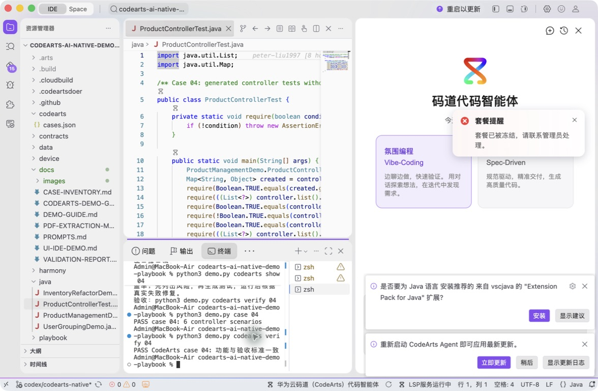

# 案例 04：商品控制器单元测试生成

[返回 20 案例截图索引](../UI-IDE-CASE-SCREENSHOTS.md)

本页截图来自本案例独立启动的 CodeArts Agent IDE 操作。主文件：`java/ProductControllerTest.java`。

## 步骤 1：打开主文件

检查六类控制器场景。

## 步骤 2：码道案例卡

核对测试、实现和 Terminal 上下文。

## 步骤 3：实际运行

确认六个场景通过。

## 步骤 4：独立验收

确认案例级验收 PASS。

完成后确认没有遗留案例服务器；Web 案例必须先 `Ctrl+C`，再执行独立验收。

