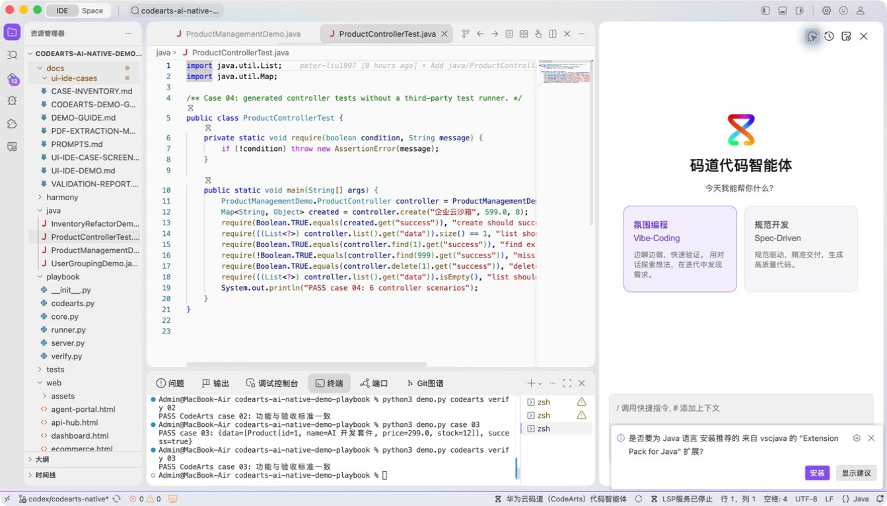
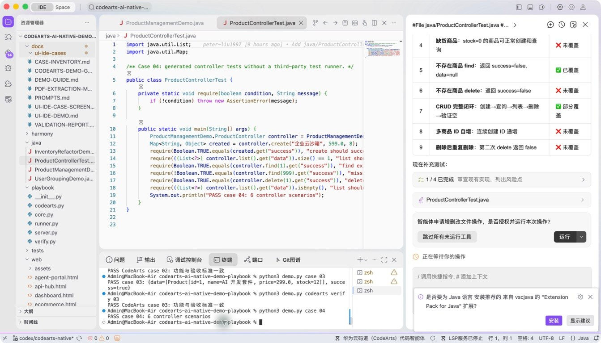
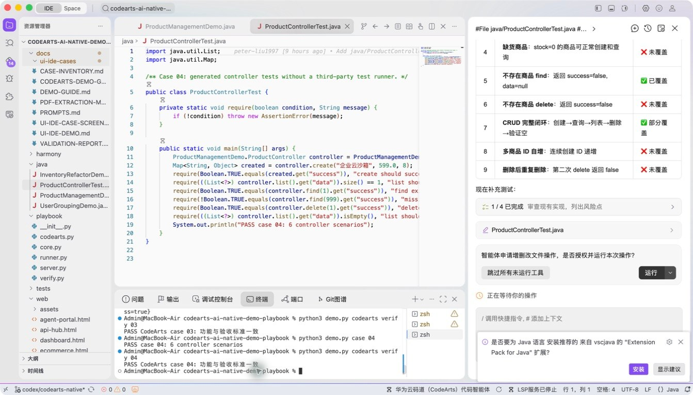

# 案例 04：商品控制器单元测试生成

[返回 20 案例截图索引](../UI-IDE-CASE-SCREENSHOTS.md)

## 项目背景

- 业务场景：商品控制器已有实现，但发布前需要用单元测试锁定 CRUD、库存扣减和错误处理行为。
- 原始痛点：只追求覆盖率容易产生“执行过却没有验证业务风险”的弱断言，失败后还要人工来回定位实现与测试。
- 演示目标与边界：按风险设计六类测试并现场运行，测试保持轻量、可重复，不依赖 JUnit 或外部服务。

## 本案例使用的码道能力

| 维度 | 内容 |
|---|---|
| 工作模式 | 探索模式（Vibe-Coding），围绕已有实现快速补齐质量保障。 |
| 关键上下文 | `#File java/ProductControllerTest.java`、`#File java/ProductManagementDemo.java`、`#Terminal Last Command`。 |
| 智能工程动作 | 先提取业务风险，再生成正常 CRUD、非法输入、资源不存在和库存不足等测试。 |
| 验证与治理 | 将终端失败信息带回对话形成“生成—运行—修复—复验”闭环，所有断言必须表达业务结果。 |
| 客户价值 | 展示码道不只写测试代码，还能围绕风险设计用例并缩短失败定位时间。 |

本页截图来自本案例独立启动的 CodeArts Agent IDE 操作。主文件：`java/ProductControllerTest.java`。

## 步骤 1：打开主文件

检查六类控制器场景。

## 步骤 2：码道对话与结果

核对测试、实现和 Terminal 上下文。 检查码道的上下文读取、分析过程、命令证据和验收结论。

## 步骤 3：实际运行

确认六个场景通过。

## 步骤 4：独立验收

确认案例级验收 PASS。

完成后确认没有遗留案例服务器；Web 案例必须先 `Ctrl+C`，再执行独立验收。
