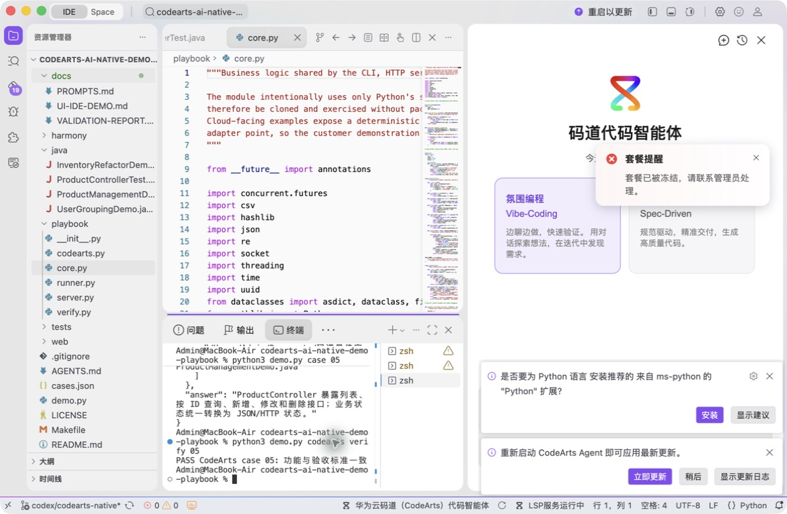

# 案例 05：代码库上下文问答

[返回 20 案例截图索引](../UI-IDE-CASE-SCREENSHOTS.md)

本页截图来自本案例独立启动的 CodeArts Agent IDE 操作。主文件：`playbook/core.py`。

## 步骤 1：打开主文件

定位 CodebaseIndex 实现。

## 步骤 2：码道案例卡

核对文件、符号和不臆造要求。

## 步骤 3：实际运行

查看真实 Java 符号索引和问答命中。

## 步骤 4：独立验收

确认案例级验收 PASS。

完成后确认没有遗留案例服务器；Web 案例必须先 `Ctrl+C`，再执行独立验收。

