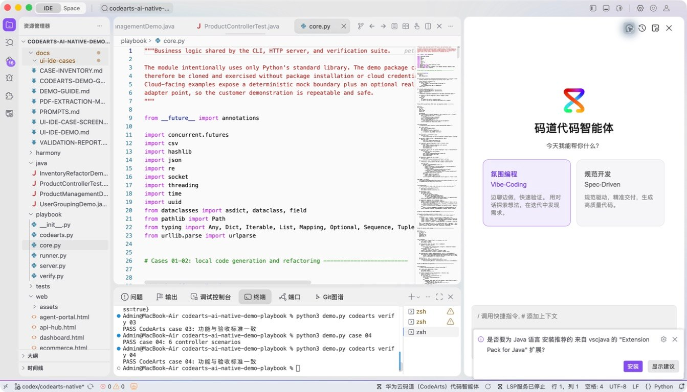
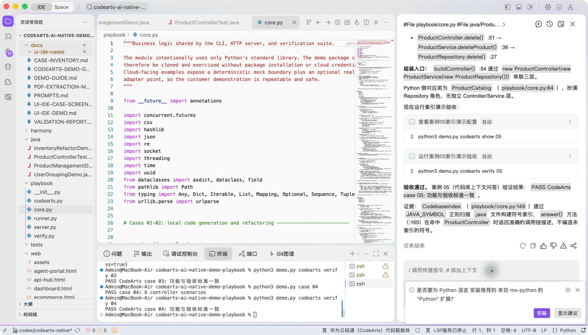
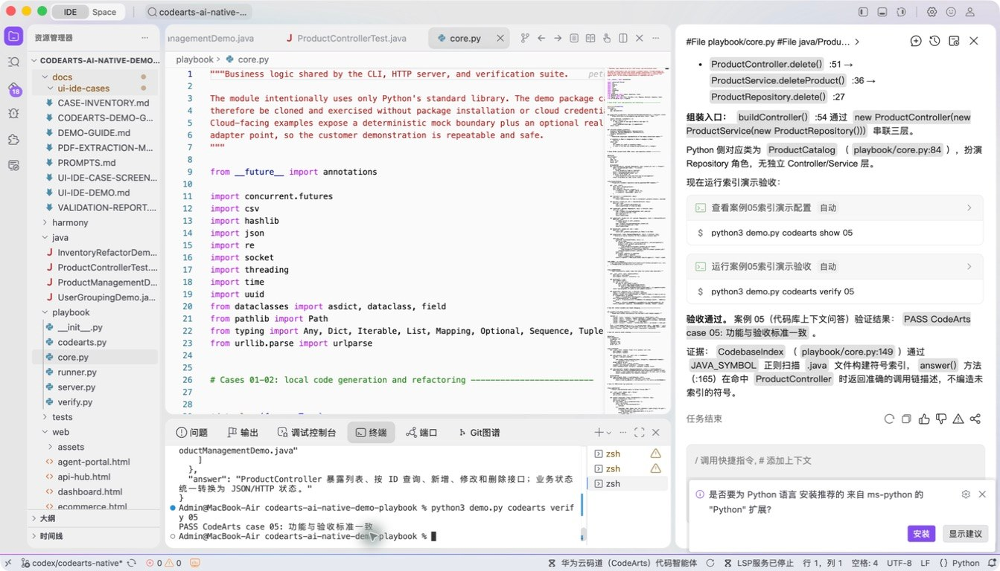

# 案例 05：代码库上下文问答

[返回 20 案例截图索引](../UI-IDE-CASE-SCREENSHOTS.md)

## 项目背景

- 业务场景：新成员或客户评审者需要快速理解陌生代码库中的入口、核心符号及调用关系。
- 原始痛点：仅凭文件名做通用回答容易产生幻觉，也无法说明结论来自哪段真实代码或哪次变更。
- 演示目标与边界：只基于仓库中可检索到的文件、符号和 Git 证据回答问题；不存在的对象必须明确说明未找到。

## 本案例使用的码道能力

| 维度 | 内容 |
|---|---|
| 工作模式 | 探索模式（Vibe-Coding），通过追问逐层建立代码库心智模型。 |
| 关键上下文 | `#File playbook/core.py`、`#Symbol ProductManagement`、`#Git`。 |
| 智能工程动作 | 组合文件、符号索引与版本信息，定位定义和引用，并给出有证据边界的代码库问答。 |
| 验证与治理 | 对回答中的符号执行匹配检查；仓库未出现的符号不得被描述成既有实现。 |
| 客户价值 | 展示码道如何加速代码库熟悉、交接和评审，同时降低基于猜测回答的风险。 |

本页截图来自本案例独立启动的 CodeArts Agent IDE 操作。主文件：`playbook/core.py`。

## 步骤 1：打开主文件

定位 CodebaseIndex 实现。

## 步骤 2：码道对话与结果

核对文件、符号和不臆造要求。 检查码道的上下文读取、分析过程、命令证据和验收结论。

## 步骤 3：实际运行

查看真实 Java 符号索引和问答命中。

## 步骤 4：独立验收

确认案例级验收 PASS。

完成后确认没有遗留案例服务器；Web 案例必须先 `Ctrl+C`，再执行独立验收。
