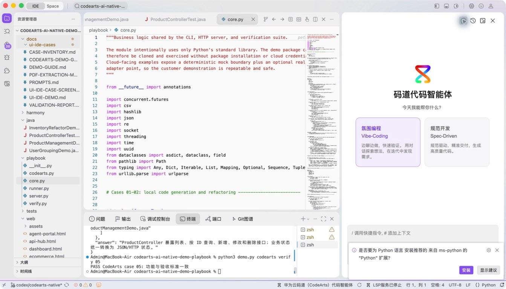
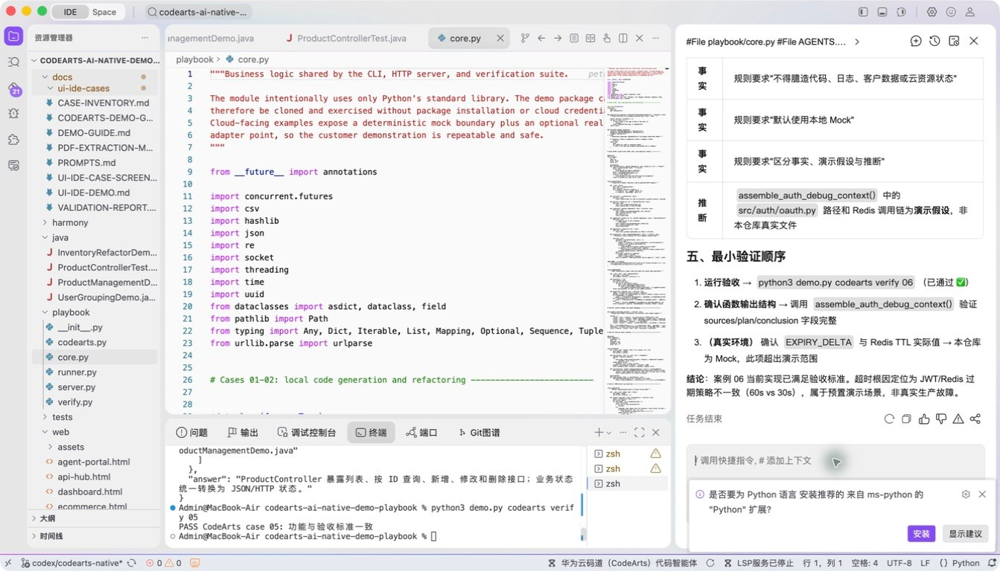
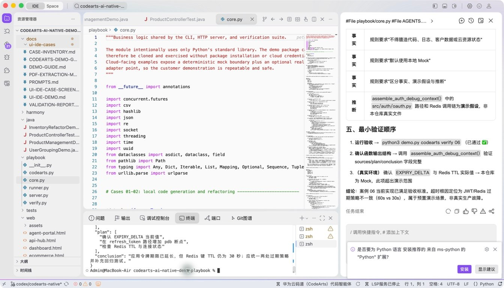
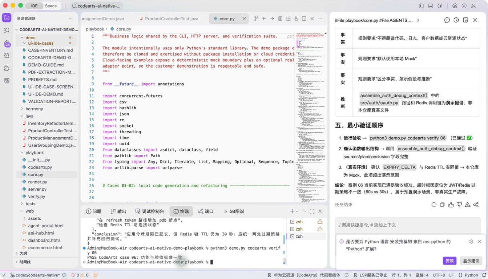

# 案例 06：认证超时协同排查

[返回 20 案例截图索引](../UI-IDE-CASE-SCREENSHOTS.md)

## 项目背景

- 业务场景：认证接口偶发超时，线索可能分散在应用逻辑、缓存依赖、最近提交和终端输出中。
- 原始痛点：单看一段代码容易把相关性当因果；没有证据分级时，排障建议可能演变为对生产故障的臆测。
- 演示目标与边界：组织一条可验证的排障路径，区分“已观察事实、推测原因、待采集证据”；案例不伪造生产日志。

## 本案例使用的码道能力

| 维度 | 内容 |
|---|---|
| 工作模式 | 探索模式（Vibe-Coding），适合多轮提出假设、验证和收敛。 |
| 关键上下文 | `#File playbook/core.py`、`#File AGENTS.md`、`#Git`、`#Terminal Last Command`。 |
| 智能工程动作 | 汇集多源上下文，按规则约束结论，并形成可复用的 Debug Skill 排障步骤。 |
| 验证与治理 | 每条结论标注证据等级，修复建议坚持最小改动并配套可复现验证命令。 |
| 客户价值 | 展示码道用上下文工程协同排障，帮助团队降低平均故障定位时间。 |

本页截图来自本案例独立启动的 CodeArts Agent IDE 操作。主文件：`playbook/core.py`。

## 步骤 1：打开主文件

查看上下文装配逻辑。

## 步骤 2：码道对话与结果

核对 File、Git、Terminal 和 Rules 上下文。 检查码道的上下文读取、分析过程、命令证据和验收结论。

## 步骤 3：实际运行

查看事实、推断和待验证项。

## 步骤 4：独立验收

确认案例级验收 PASS。

完成后确认没有遗留案例服务器；Web 案例必须先 `Ctrl+C`，再执行独立验收。
