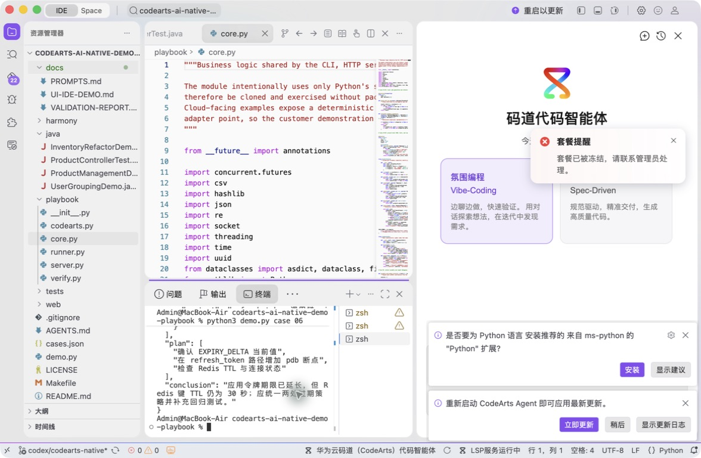
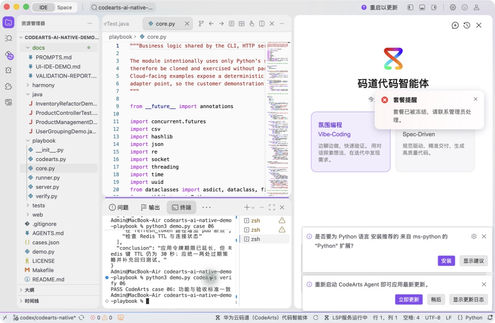

# 案例 06：认证超时协同排查

[返回 20 案例截图索引](../UI-IDE-CASE-SCREENSHOTS.md)

本页截图来自本案例独立启动的 CodeArts Agent IDE 操作。主文件：`playbook/core.py`。

## 步骤 1：打开主文件

查看上下文装配逻辑。

## 步骤 2：码道案例卡

核对 File、Git、Terminal 和 Rules 上下文。

## 步骤 3：实际运行

查看事实、推断和待验证项。

## 步骤 4：独立验收

确认案例级验收 PASS。

完成后确认没有遗留案例服务器；Web 案例必须先 `Ctrl+C`，再执行独立验收。

