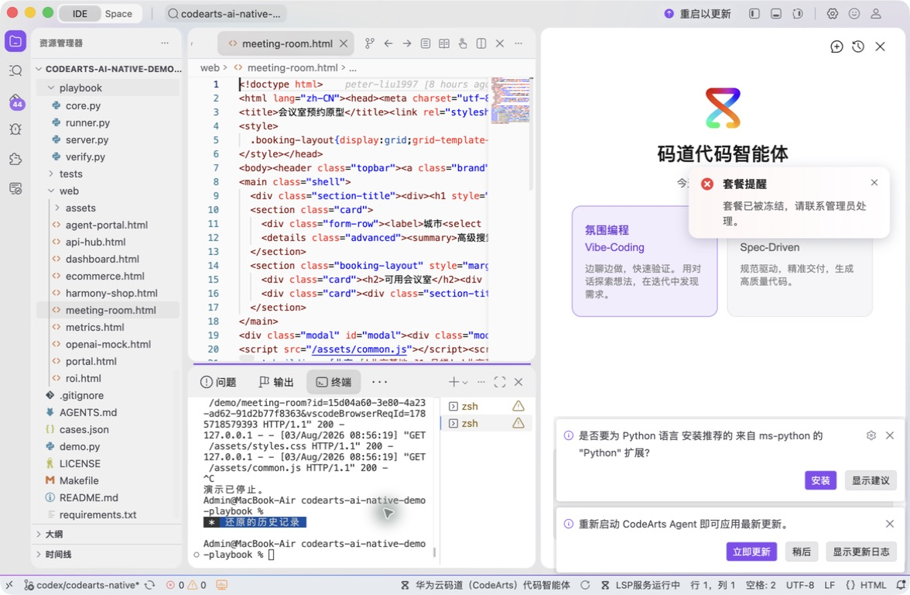
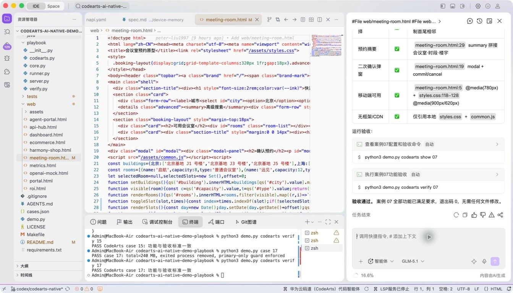
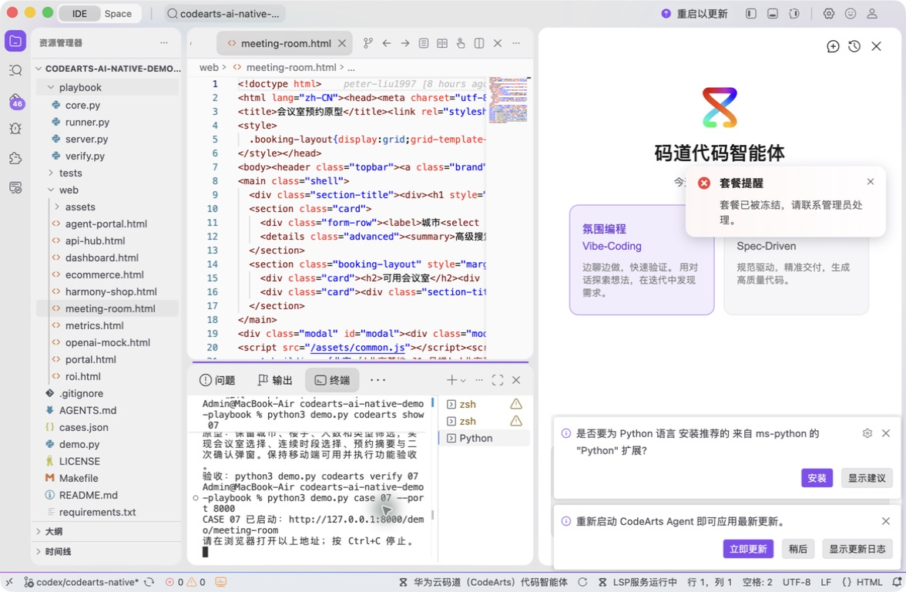
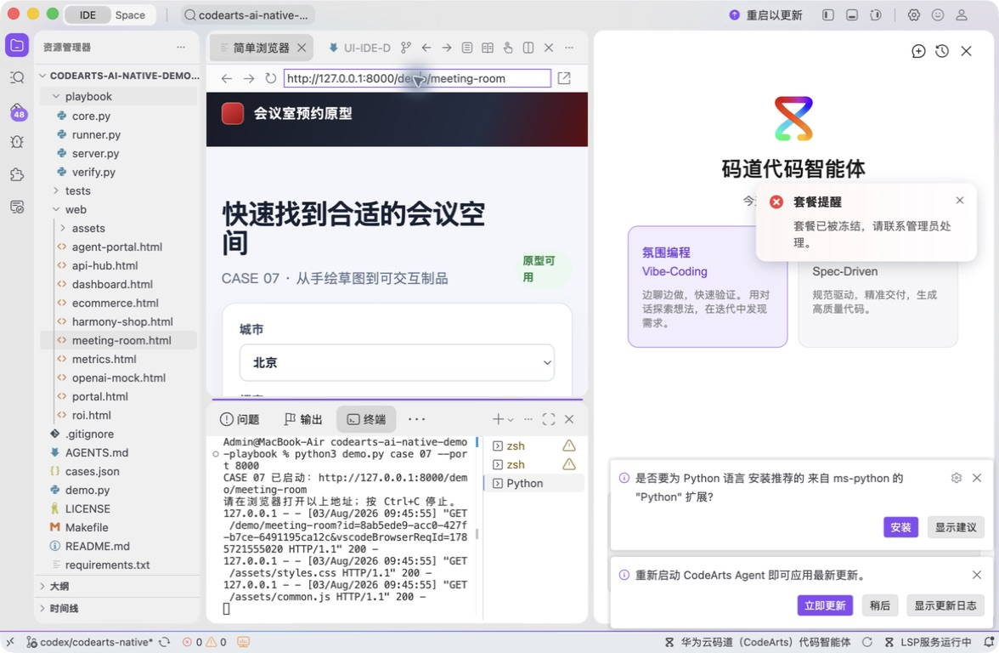
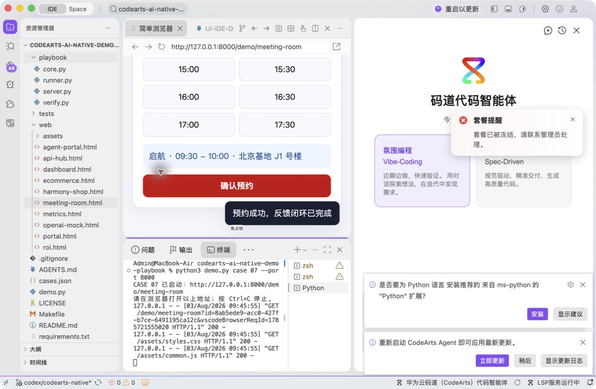
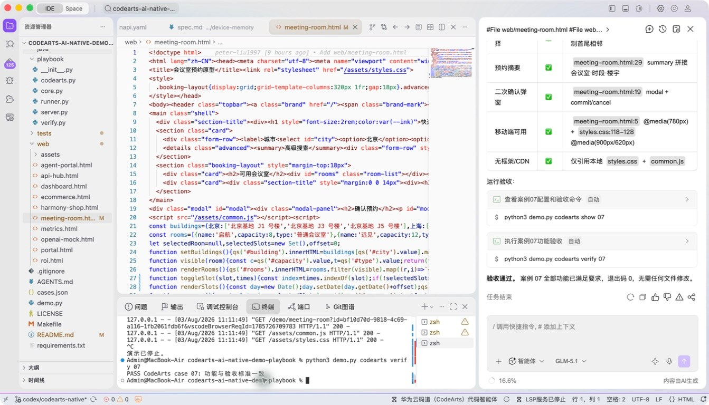

# 案例 07：会议室预约原型

[返回 20 案例截图索引](../UI-IDE-CASE-SCREENSHOTS.md)

## 项目背景

- 业务场景：产品经理希望在需求评审前快速获得一个可点击的会议室预约原型，用交互验证页面流程。
- 原始痛点：文字或静态稿难暴露筛选、时间冲突、空状态和移动端布局问题，等到正式开发再改成本较高。
- 演示目标与边界：使用原生 HTML、CSS 和 JavaScript 生成可离线运行的原型；数据为演示数据，不连接企业真实会议系统。

## 本案例使用的码道能力

| 维度 | 内容 |
|---|---|
| 工作模式 | 探索模式（Vibe-Coding），适合从模糊想法快速形成可交互原型。 |
| 关键上下文 | `#File web/meeting-room.html`、`#File web/styles.css`、`#File web/common.js`。 |
| 智能工程动作 | 跨文件生成页面结构、统一样式与交互状态，并根据现场反馈迭代响应式布局。 |
| 验证与治理 | 在 IDE 内置浏览器逐项操作筛选、预约和异常提示，验证桌面与窄屏布局。 |
| 客户价值 | 展示码道缩短“需求描述—可操作原型—评审反馈”的产品验证周期。 |

本页截图来自本案例独立启动的 CodeArts Agent IDE 操作。主文件：`web/meeting-room.html`。

## 步骤 1：打开主文件

检查页面结构。

## 步骤 2：码道案例卡

核对 Vibe-Coding、HTML、样式和 Rules 上下文。

## 步骤 3：启动专用服务

单独启动案例 07 服务。

## 步骤 4：内置浏览器初始状态

在 Simple Browser 打开页面。

## 步骤 5：完成页面交互

选择“启航”、09:30–10:00并完成二次确认。

## 步骤 6：独立验收

停止服务器并确认案例级验收 PASS。

完成后确认没有遗留案例服务器；Web 案例必须先 `Ctrl+C`，再执行独立验收。
