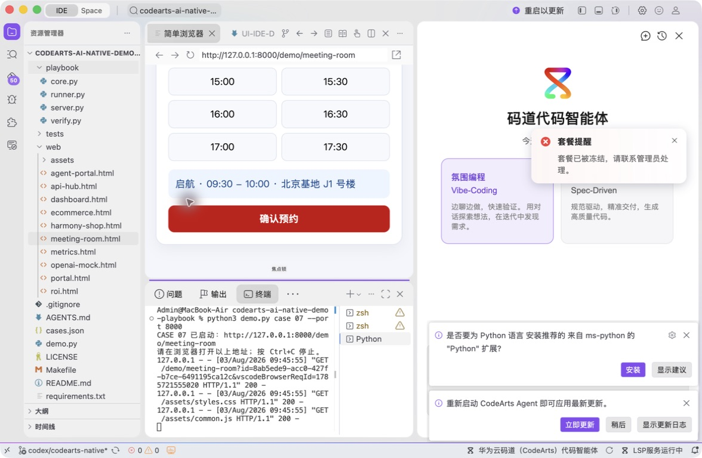
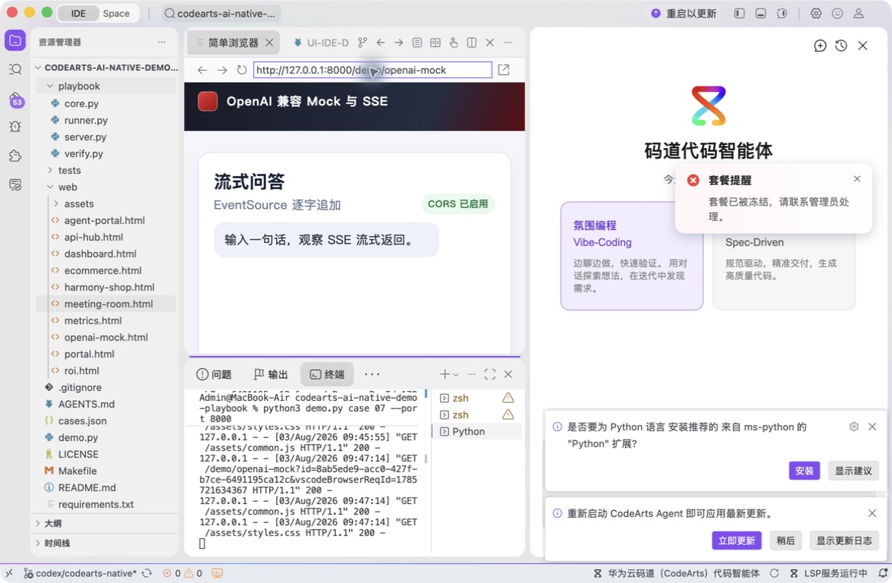
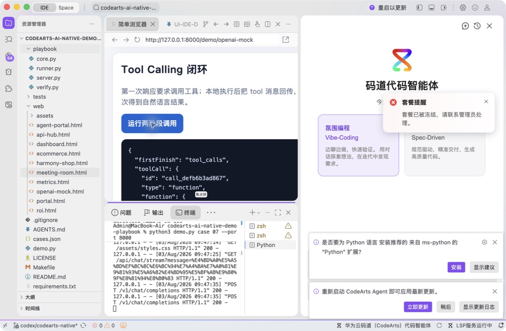
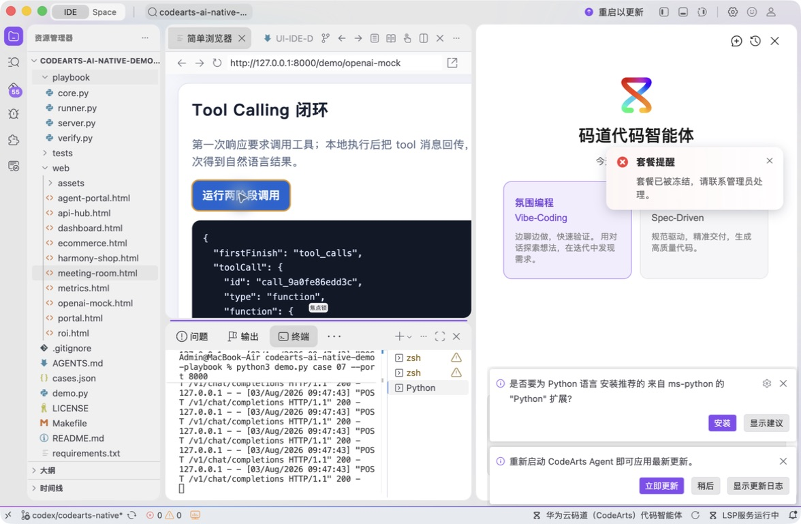

# 案例 08：OpenAI 兼容 Mock 与 SSE

[返回 20 案例截图索引](../UI-IDE-CASE-SCREENSHOTS.md)

本页截图来自本案例独立启动的 CodeArts Agent IDE 操作。主文件：`playbook/server.py`。

## 步骤 1：打开主文件

查看本地协议服务入口。

## 步骤 2：码道案例卡

核对 Tool Calling、SSE 与 CORS 要求。

## 步骤 3：启动专用服务

单独启动案例 08 服务。

## 步骤 4：内置浏览器初始状态

在 Simple Browser 打开协议 Mock 页面。

## 步骤 5：完成页面交互

执行 SSE 和 Tool Calling 两阶段闭环。

## 步骤 6：独立验收

停止服务器并确认案例级验收 PASS。

完成后确认没有遗留案例服务器；Web 案例必须先 `Ctrl+C`，再执行独立验收。

