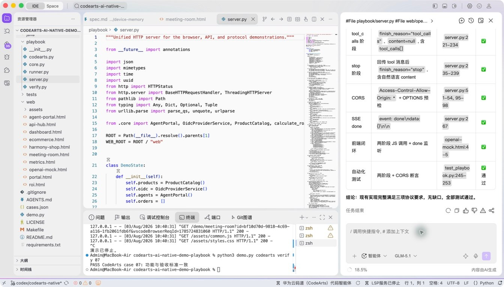
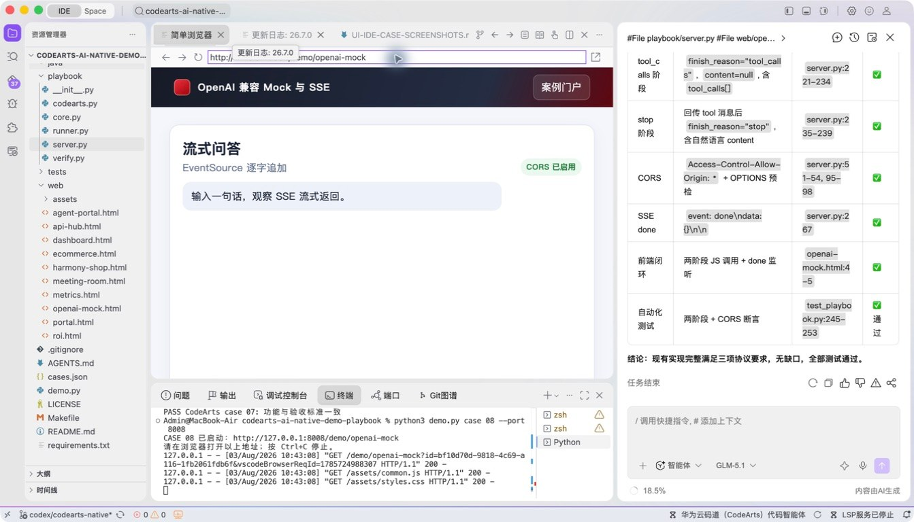
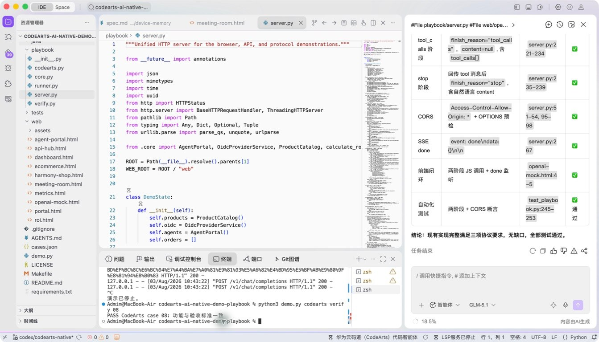

# 案例 08：OpenAI 兼容 Mock 与 SSE

[返回 20 案例截图索引](../UI-IDE-CASE-SCREENSHOTS.md)

## 项目背景

- 业务场景：前端或智能体应用需要在真实模型服务尚未就绪时，基于 OpenAI 兼容协议并行开发和联调。
- 原始痛点：简单固定响应无法覆盖工具调用的两阶段消息、SSE 流式分片、CORS 和错误协议，联调时才会集中暴露问题。
- 演示目标与边界：实现仅供本地演示的兼容 Mock 服务和调试页，不调用真实大模型，也不保存访问密钥。

## 本案例使用的码道能力

| 维度 | 内容 |
|---|---|
| 工作模式 | 探索模式（Vibe-Coding），从协议目标快速形成可联调服务。 |
| 关键上下文 | `#File playbook/server.py`、`#File web/openai-mock.html`、`#File tests/test_playbook.py`。 |
| 智能工程动作 | 检查兼容协议，补全普通响应、工具调用两阶段流程、SSE 流式响应及 CORS 处理。 |
| 验证与治理 | 同时运行 HTTP 自动化测试和浏览器交互，核对状态码、消息结构、分片结束标记与错误返回。 |
| 客户价值 | 展示码道理解跨栈协议并快速构造可复用联调环境，减少前后端等待。 |

本页截图来自本案例独立启动的 CodeArts Agent IDE 操作。主文件：`playbook/server.py`。

## 步骤 1：打开主文件

查看本地协议服务入口。

## 步骤 2：码道案例卡

核对 Tool Calling、SSE 与 CORS 要求。

## 步骤 3：启动专用服务

单独启动案例 08 服务。

## 步骤 4：内置浏览器初始状态

在 Simple Browser 打开协议 Mock 页面。

## 步骤 5：完成页面交互

执行 SSE 和 Tool Calling 两阶段闭环。

## 步骤 6：独立验收

停止服务器并确认案例级验收 PASS。

完成后确认没有遗留案例服务器；Web 案例必须先 `Ctrl+C`，再执行独立验收。
