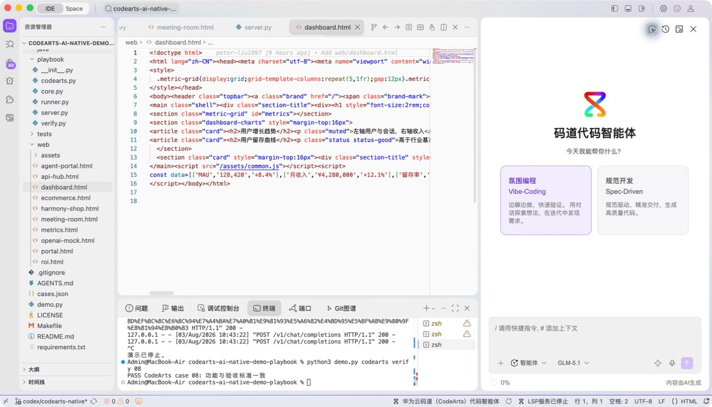
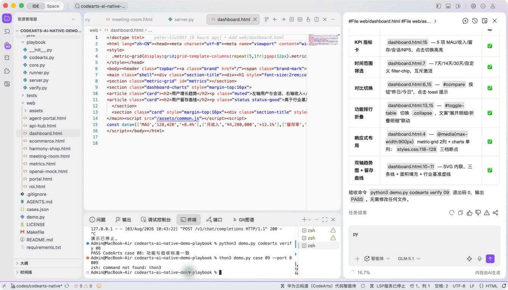
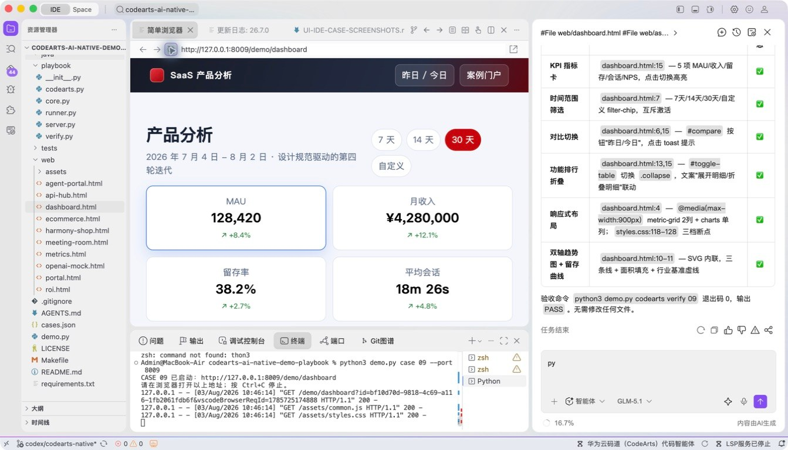
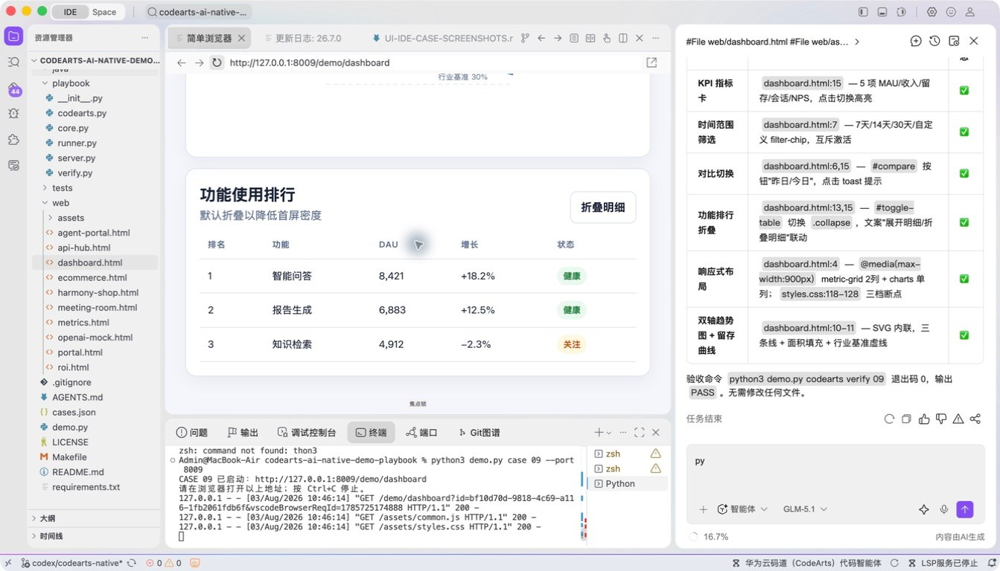
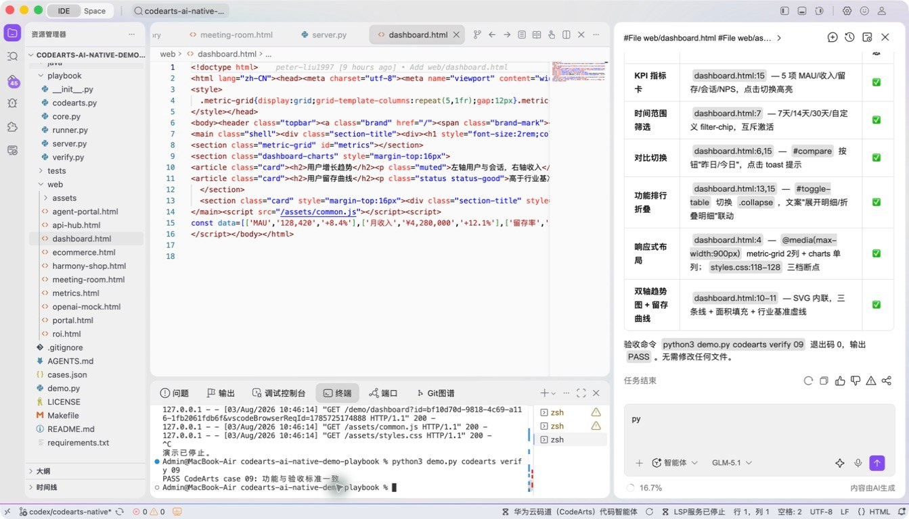

# 案例 09：SaaS 产品分析看板

[返回 20 案例截图索引](../UI-IDE-CASE-SCREENSHOTS.md)

## 项目背景

- 业务场景：SaaS 团队需要用统一看板查看产品使用、客户分层和增长趋势，并根据评审意见持续调整局部体验。
- 原始痛点：让 AI 直接重写整页容易破坏既有设计体系，造成颜色、间距、交互和响应式行为漂移。
- 演示目标与边界：在现有 HTML/CSS 设计约束内完成卡片、图表和筛选交互；数据均为静态演示数据。

## 本案例使用的码道能力

| 维度 | 内容 |
|---|---|
| 工作模式 | 探索模式（Vibe-Coding），支持围绕视觉反馈持续微调。 |
| 关键上下文 | `#File web/dashboard.html`、`#File web/styles.css`、`#File web/common.js`。 |
| 智能工程动作 | 读取现有设计系统，在限定区域内修改组件、数据绑定和交互，而非全页无差别重写。 |
| 验证与治理 | 使用内置浏览器验证筛选、图表状态、键盘操作和响应式布局，保持公共样式不回归。 |
| 客户价值 | 展示码道在遵循既有前端规范的同时快速迭代，降低设计漂移和返工。 |

本页截图来自本案例独立启动的 CodeArts Agent IDE 操作。主文件：`web/dashboard.html`。

## 步骤 1：打开主文件

检查页面和设计系统入口。

## 步骤 2：码道对话与结果

核对设计规范和局部修改上下文。 检查码道的上下文读取、分析过程、命令证据和验收结论。

## 步骤 3：启动专用服务

单独启动案例 09 服务。

## 步骤 4：内置浏览器初始状态

在 Simple Browser 打开看板。

## 步骤 5：完成页面交互

切换 30 天、选择留存率并展开排行。

## 步骤 6：独立验收

停止服务器并确认案例级验收 PASS。

完成后确认没有遗留案例服务器；Web 案例必须先 `Ctrl+C`，再执行独立验收。
