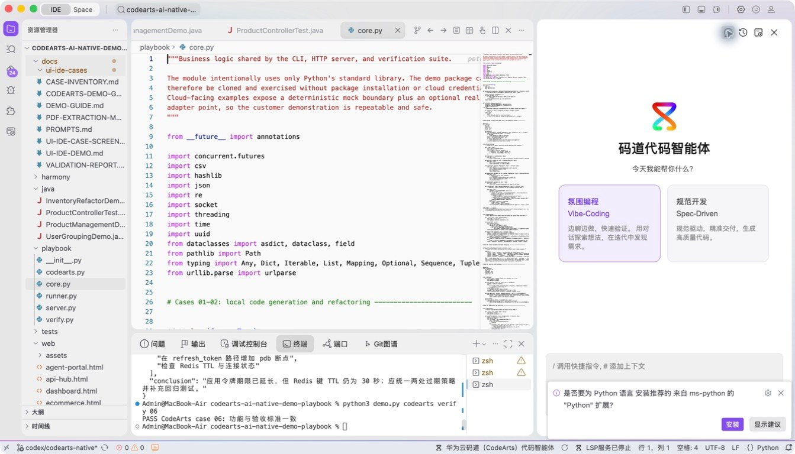
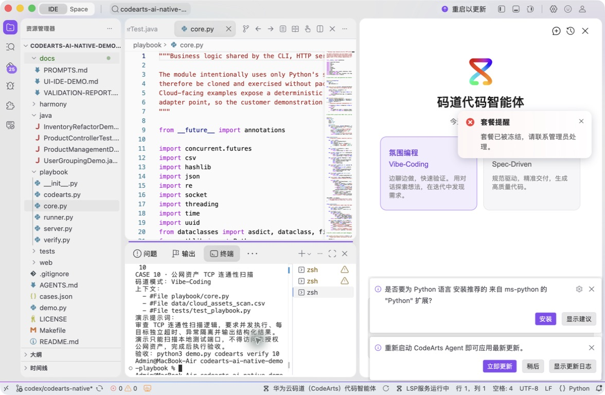
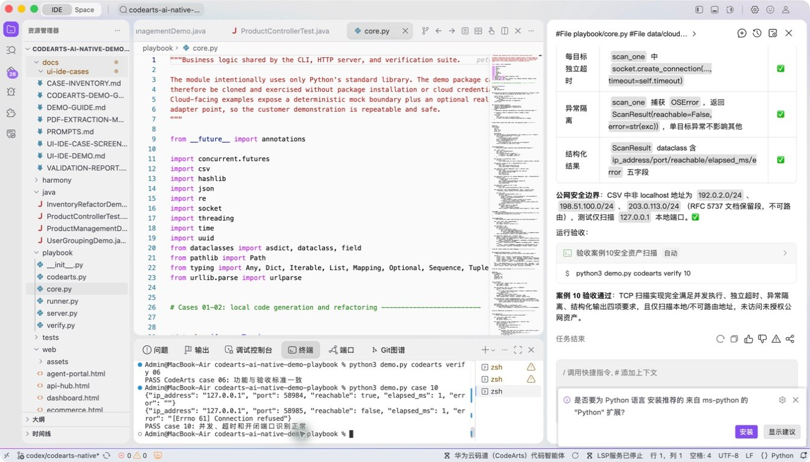
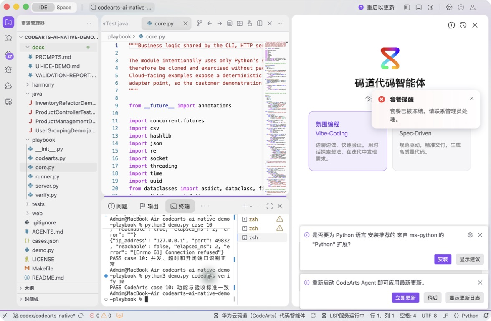

# 案例 10：公网资产 TCP 连通性扫描

[返回 20 案例截图索引](../UI-IDE-CASE-SCREENSHOTS.md)

## 项目背景

- 业务场景：运维人员希望把零散的 Telnet 检查改造成可批量执行、可导出结果的 TCP 连通性扫描工具。
- 原始痛点：临时脚本常缺少并发、超时、输入校验和结构化输出，还可能被误用于未经授权的目标。
- 演示目标与边界：实现可复用扫描流程并仅对本机测试服务验证；所有外部网络扫描都必须获得资产授权。

## 本案例使用的码道能力

| 维度 | 内容 |
|---|---|
| 工作模式 | 探索模式（Vibe-Coding），把一次性操作逐步工程化为可重复工具。 |
| 关键上下文 | `#File playbook/core.py`、`#File data/targets.csv`、`#File tests/test_playbook.py`。 |
| 智能工程动作 | 完善需求，生成并发扫描、连接超时、错误分类和 CSV/JSON 结构化结果，并识别可沉淀的项目 Skill。 |
| 验证与治理 | 使用本地开放端口和关闭端口做正反例验证；文档明确授权边界与最小网络访问原则。 |
| 客户价值 | 展示码道把个人排障命令升级为可审计、可复用的运维工程能力。 |

本页截图来自本案例独立启动的 CodeArts Agent IDE 操作。主文件：`playbook/core.py`。

## 步骤 1：打开主文件

定位 TcpScanner。

## 步骤 2：码道案例卡

确认只扫描本机授权端口。

## 步骤 3：实际运行

观察本地开端口与闭端口结果。

## 步骤 4：独立验收

确认案例级验收 PASS。

完成后确认没有遗留案例服务器；Web 案例必须先 `Ctrl+C`，再执行独立验收。
