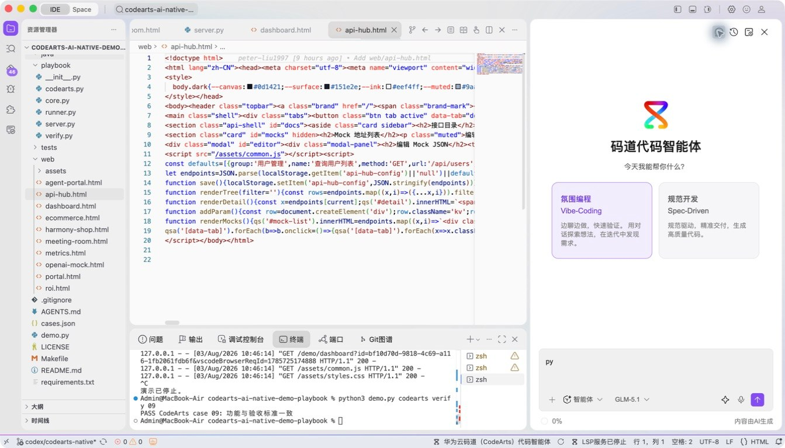
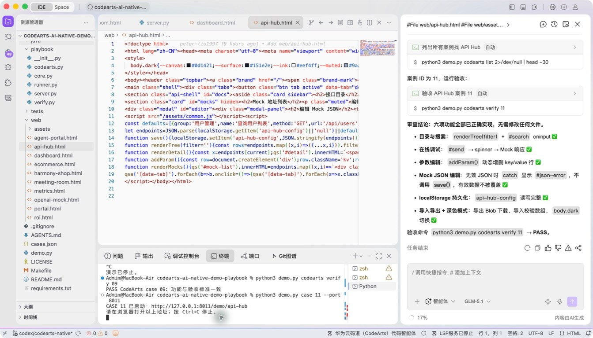
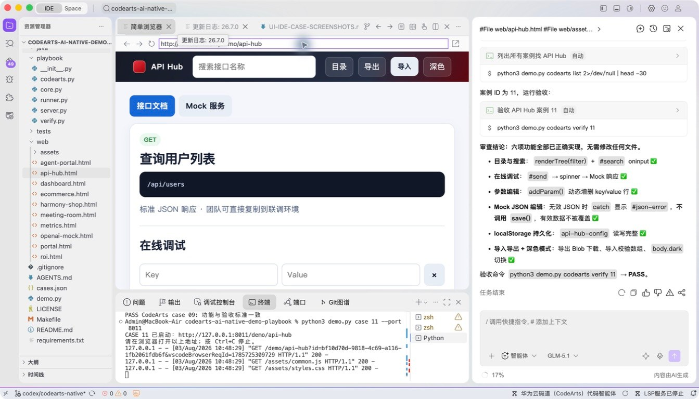
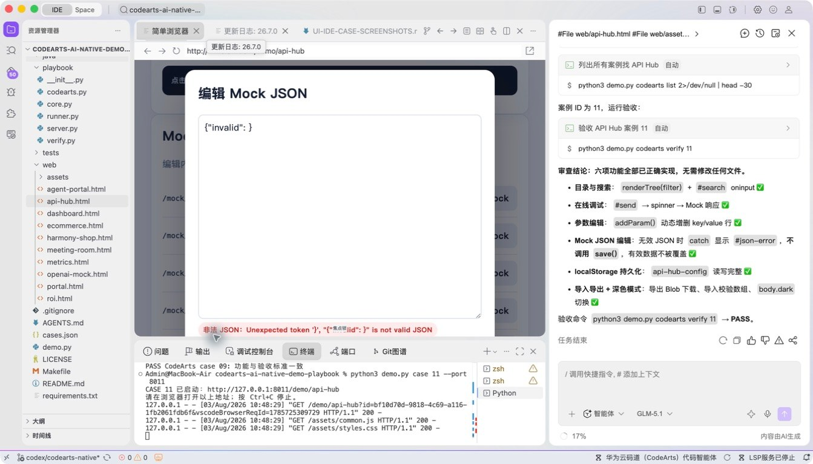
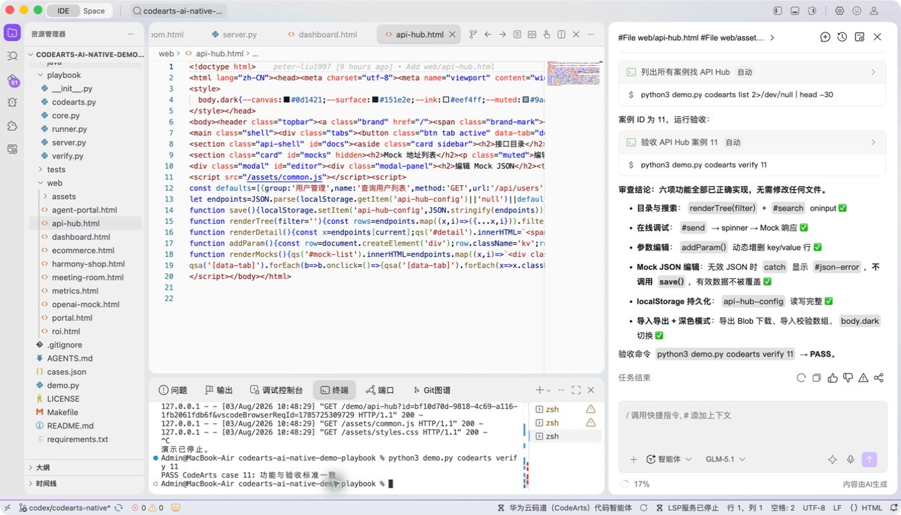

# 案例 11：API Hub 接口管理工具

[返回 20 案例截图索引](../UI-IDE-CASE-SCREENSHOTS.md)

## 项目背景

- 业务场景：研发团队需要一个轻量 API Hub，用于登记接口、搜索文档、查看示例并保存本地编辑结果。
- 原始痛点：一次性“大爆炸”生成容易同时引入持久化覆盖、非法 JSON 和 XSS 等问题，调试范围难以控制。
- 演示目标与边界：按六轮对话从骨架演进到质量加固；采用本地 Mock 与浏览器存储，不替代生产 API 管理平台。

## 本案例使用的码道能力

| 维度 | 内容 |
|---|---|
| 工作模式 | 探索模式（Vibe-Coding），以连续对话管理逐轮演进。 |
| 关键上下文 | `#File web/api-hub.html`、`#File web/styles.css`、`#File web/common.js`。 |
| 智能工程动作 | 依次完成页面骨架、问题修复、Mock 数据、体验优化、本地持久化和安全加固。 |
| 验证与治理 | 验证非法 JSON 不覆盖旧数据、用户输入被安全渲染、重置动作可恢复初始状态。 |
| 客户价值 | 展示码道用小步可验证的方式建设内部工具，同时控制技术债和安全风险。 |

本页截图来自本案例独立启动的 CodeArts Agent IDE 操作。主文件：`web/api-hub.html`。

## 步骤 1：打开主文件

检查页面入口。

## 步骤 2：码道对话与结果

核对六轮增量 Vibe 和安全治理要求。 检查码道的上下文读取、分析过程、命令证据和验收结论。

## 步骤 3：启动专用服务

单独启动案例 11 服务。

## 步骤 4：内置浏览器初始状态

在 Simple Browser 打开 API Hub。

## 步骤 5：完成页面交互

输入非法 JSON 并确认错误被显式拦截。

## 步骤 6：独立验收

停止服务器并确认案例级验收 PASS。

完成后确认没有遗留案例服务器；Web 案例必须先 `Ctrl+C`，再执行独立验收。
