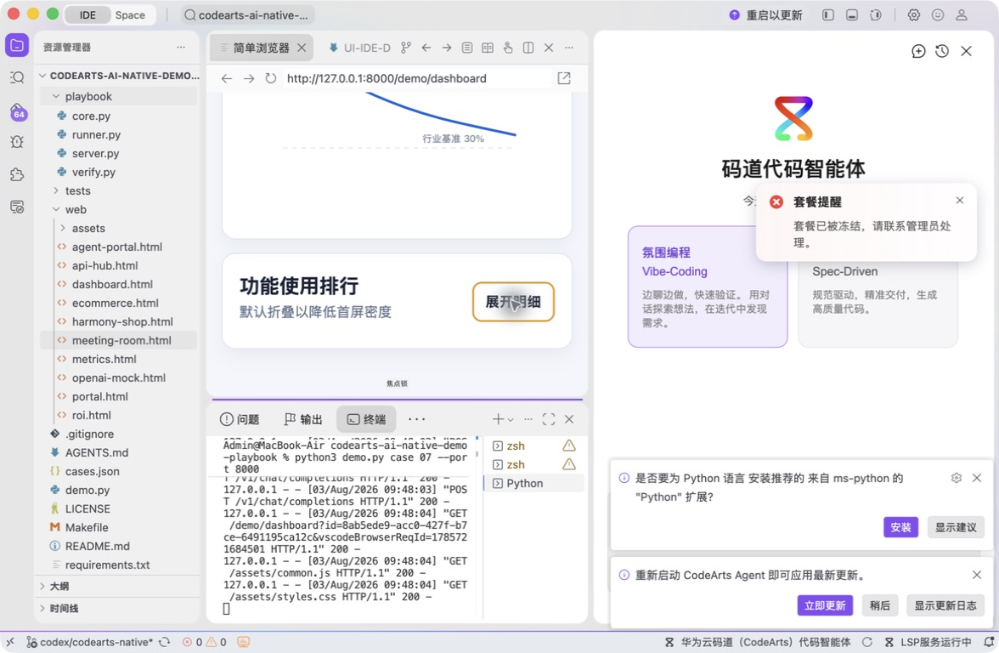
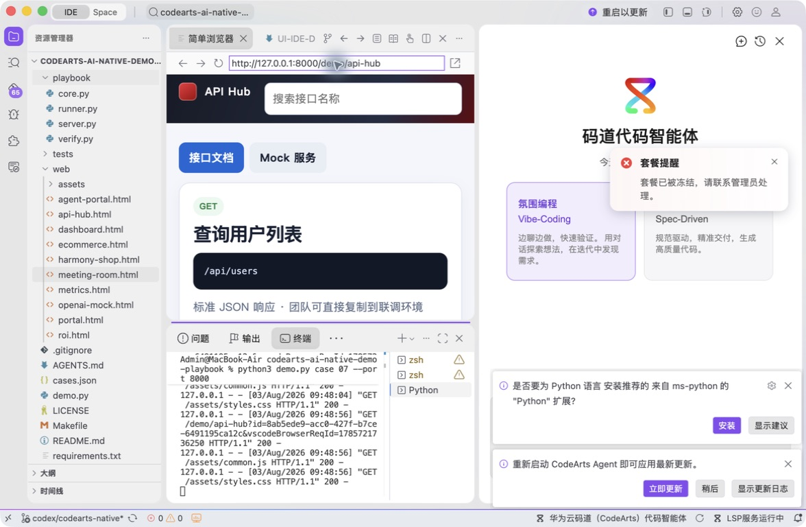

# 案例 11：API Hub 接口管理工具

[返回 20 案例截图索引](../UI-IDE-CASE-SCREENSHOTS.md)

本页截图来自本案例独立启动的 CodeArts Agent IDE 操作。主文件：`web/api-hub.html`。

## 步骤 1：打开主文件

检查页面入口。

## 步骤 2：码道案例卡

核对六轮增量 Vibe 和安全治理要求。

## 步骤 3：启动专用服务

单独启动案例 11 服务。

## 步骤 4：内置浏览器初始状态

在 Simple Browser 打开 API Hub。

## 步骤 5：完成页面交互

输入非法 JSON 并确认错误被显式拦截。

## 步骤 6：独立验收

停止服务器并确认案例级验收 PASS。

完成后确认没有遗留案例服务器；Web 案例必须先 `Ctrl+C`，再执行独立验收。

