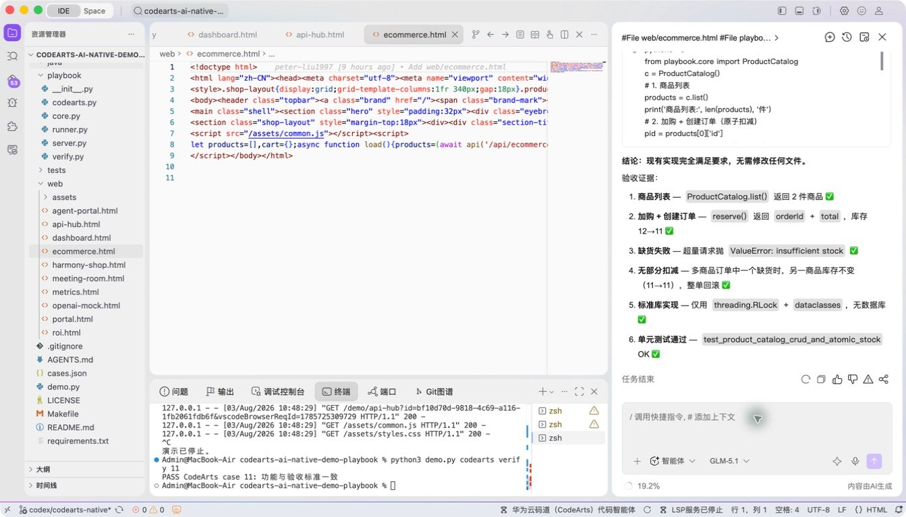
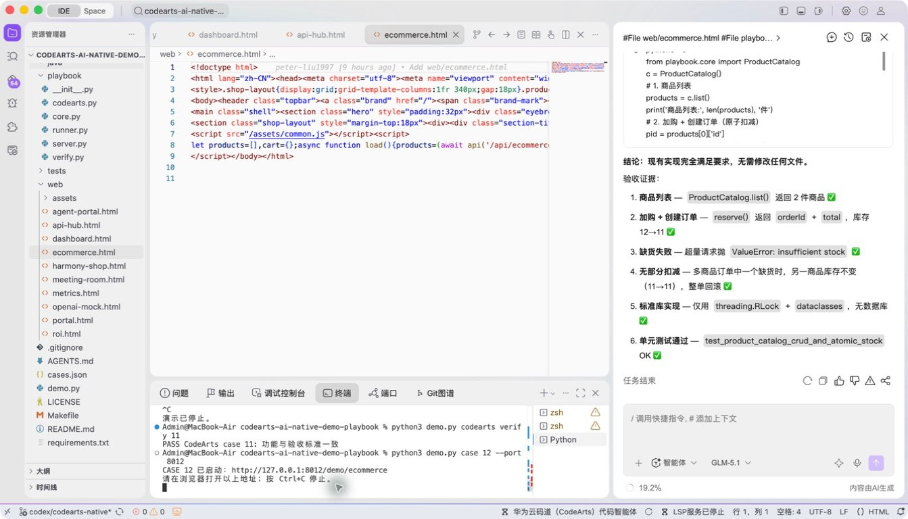
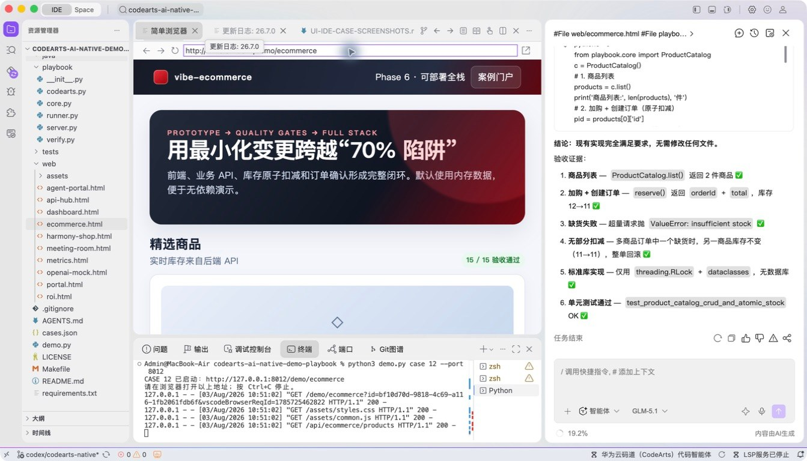
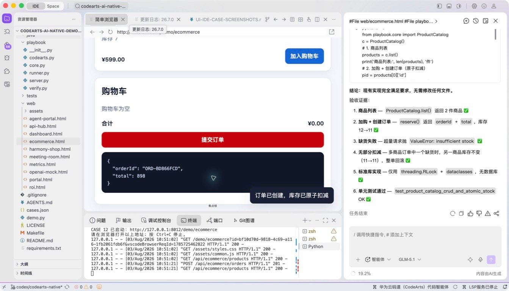

# 案例 12：电商全栈线性演进

[返回 20 案例截图索引](../UI-IDE-CASE-SCREENSHOTS.md)

## 项目背景

- 业务场景：电商创意需要先用前端原型验证，再逐步接入商品 API、购物车和库存扣减，形成可运行的端到端演示。
- 原始痛点：原型直接扩成全栈时，接口字段、前端状态和库存原子性容易不一致，造成演示可点但业务不可信。
- 演示目标与边界：演示从静态页面到本地 API 的线性演进；采用内存数据和标准库，不连接真实订单、支付或库存系统。

## 本案例使用的码道能力

| 维度 | 内容 |
|---|---|
| 工作模式 | 探索模式（Vibe-Coding），支持从原型逐轮收敛到工程实现。 |
| 关键上下文 | `#File web/ecommerce.html`、`#File playbook/server.py`、`#Symbol ProductCatalog`、`#File tests/test_playbook.py`。 |
| 智能工程动作 | 跨前后端统一商品模型、API 契约和页面状态，并围绕真实符号补全库存扣减逻辑。 |
| 验证与治理 | 浏览器验证完整购买流程，API 测试验证库存原子扣减、库存不足及重复操作。 |
| 客户价值 | 展示码道既能支撑 0→1 快速验证，也能继续补齐接口和业务一致性。 |

本页截图来自本案例独立启动的 CodeArts Agent IDE 操作。主文件：`web/ecommerce.html`。

## 步骤 1：打开主文件

检查页面入口。

## 步骤 2：码道案例卡

核对页面、服务端和测试上下文。

## 步骤 3：启动专用服务

单独启动案例 12 服务。

## 步骤 4：内置浏览器初始状态

在 Simple Browser 打开商品与购物车。

## 步骤 5：完成页面交互

加入两种商品并确认库存原子扣减。

## 步骤 6：独立验收

停止服务器并确认案例级验收 PASS。

完成后确认没有遗留案例服务器；Web 案例必须先 `Ctrl+C`，再执行独立验收。
