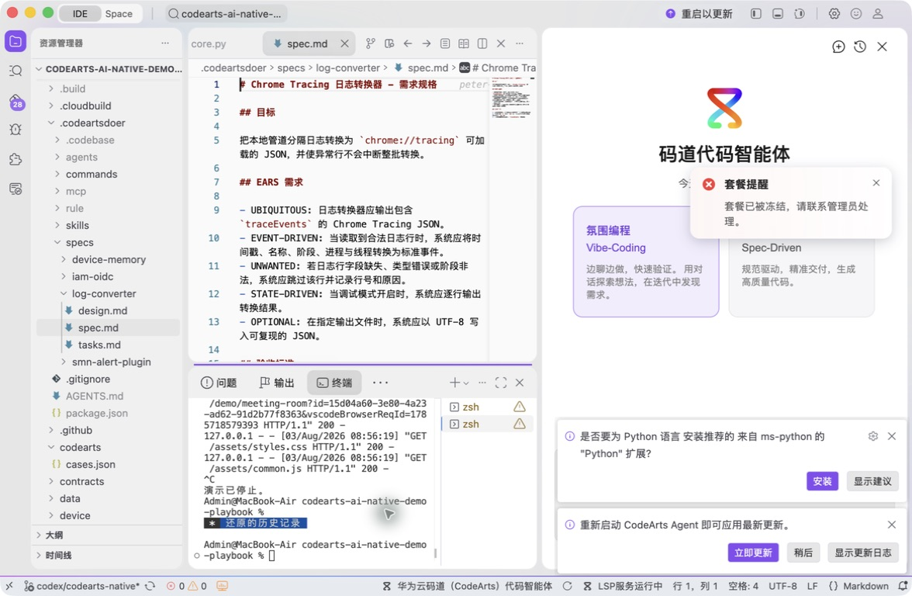
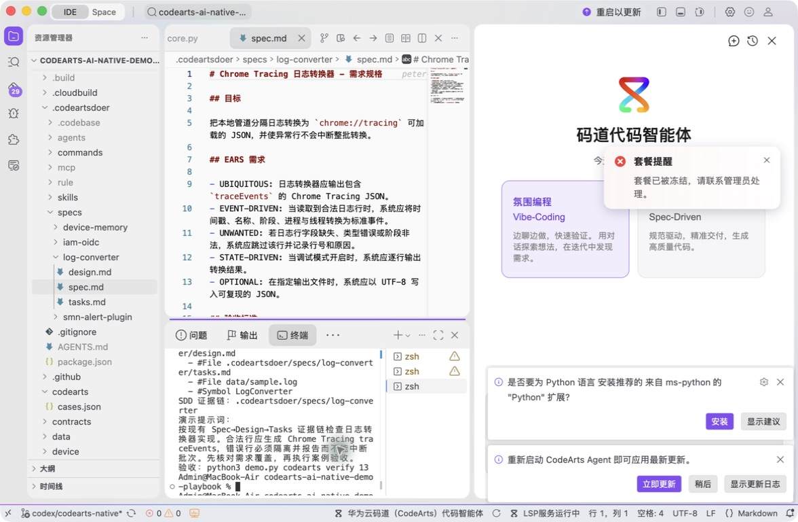
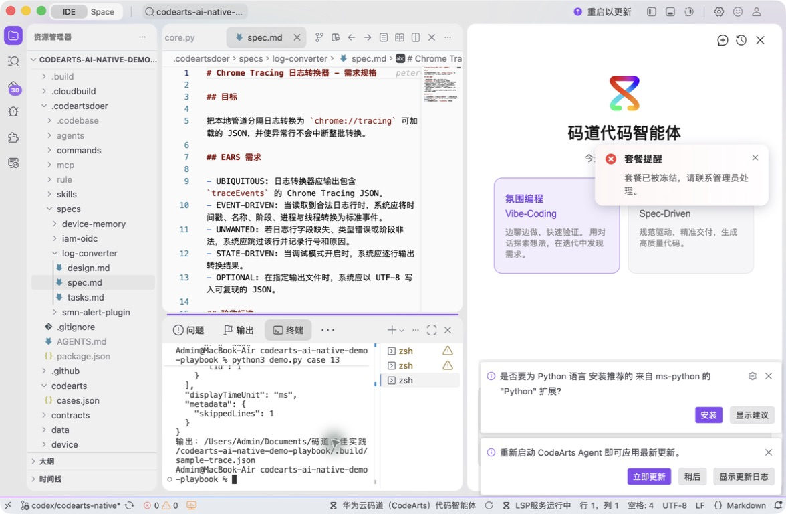
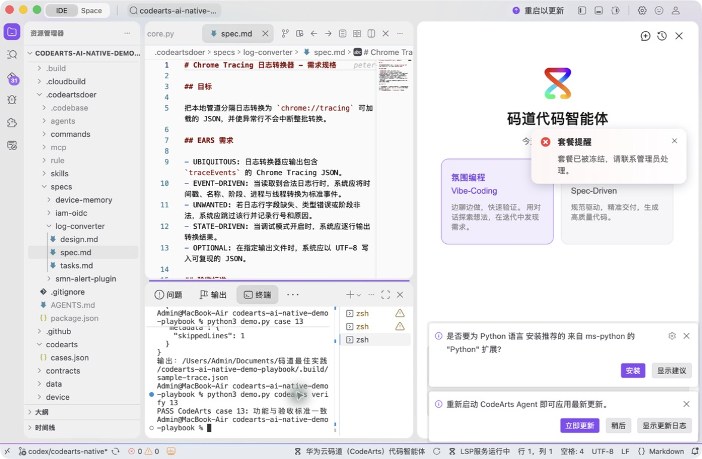

# 案例 13：Chrome Tracing 日志转换器

[返回 20 案例截图索引](../UI-IDE-CASE-SCREENSHOTS.md)

本页截图来自本案例独立启动的 CodeArts Agent IDE 操作。主文件：`.codeartsdoer/specs/log-converter/spec.md`。

## 步骤 1：打开主文件

检查 EARS 需求。

## 步骤 2：码道案例卡

核对 Spec-Driven 证据链。

## 步骤 3：实际运行

查看合法事件、隔离错误和 trace JSON。

## 步骤 4：独立验收

确认案例级验收 PASS。

完成后确认没有遗留案例服务器；Web 案例必须先 `Ctrl+C`，再执行独立验收。

