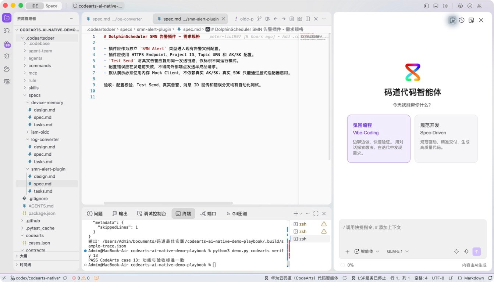
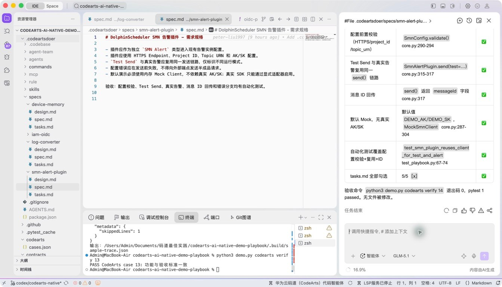
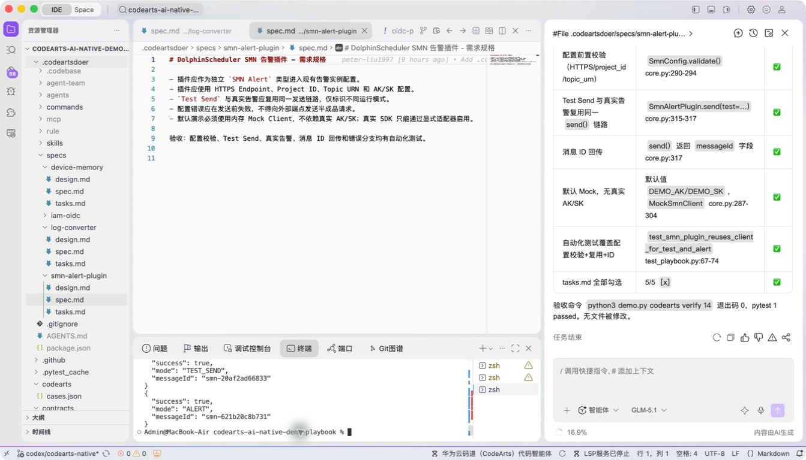
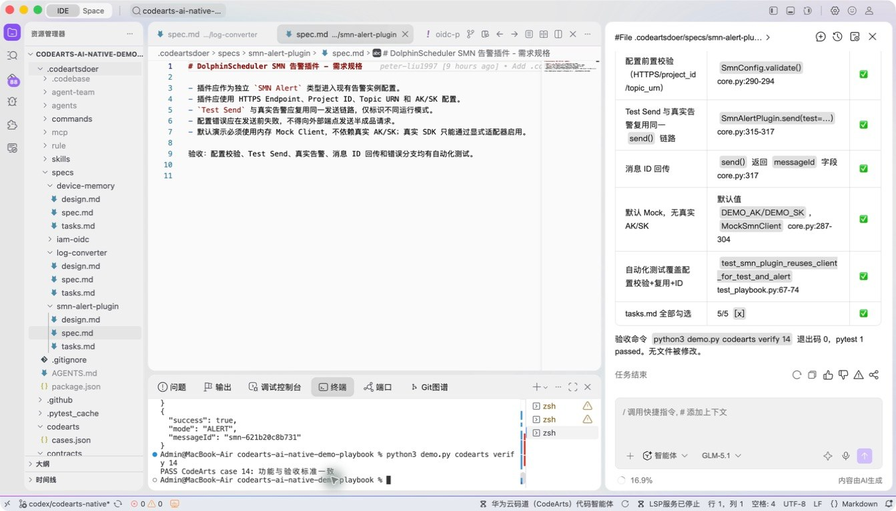

# 案例 14：DolphinScheduler SMN 告警插件

[返回 20 案例截图索引](../UI-IDE-CASE-SCREENSHOTS.md)

## 项目背景

- 业务场景：在既有 DolphinScheduler 告警体系中增加华为云 SMN 通道，并让配置页的“测试发送”和实际告警复用同一路径。
- 原始痛点：只调用云 SDK 不等于完成插件集成；扩展点、参数校验、消息 ID 回传和异常映射都可能破坏旧系统契约。
- 演示目标与边界：通过 Mock 接口演示遗留系统扩展，不使用真实 AK/SK；连接真实 SMN 时必须另行授权并安全注入凭证。

## 本案例使用的码道能力

| 维度 | 内容 |
|---|---|
| 工作模式 | 规范驱动模式（Spec-Driven），先锁定兼容边界和验收条件。 |
| 关键上下文 | `#File .codeartsdoer/specs/smn-alert-plugin/spec.md`、`design.md`、`tasks.md`、`#Symbol SmnAlertPlugin`。 |
| 智能工程动作 | 理解遗留扩展点，设计 SDK 抽象，并让测试发送与真实告警共享参数校验和发送链路。 |
| 验证与治理 | 验证 HTTPS 配置、错误映射和 `messageId` 回传；真实云端调用必须使用受控凭证。 |
| 客户价值 | 展示码道在明确契约下低风险扩展遗留系统和云服务集成。 |

本页截图来自本案例独立启动的 CodeArts Agent IDE 操作。主文件：`.codeartsdoer/specs/smn-alert-plugin/spec.md`。

## 步骤 1：打开主文件

检查插件规格。

## 步骤 2：码道对话与结果

核对 Spec-Driven 插件上下文。 检查码道的上下文读取、分析过程、命令证据和验收结论。

## 步骤 3：实际运行

查看 Test Send 与 ALERT 复用路径。

## 步骤 4：独立验收

确认案例级验收 PASS。

完成后确认没有遗留案例服务器；Web 案例必须先 `Ctrl+C`，再执行独立验收。
