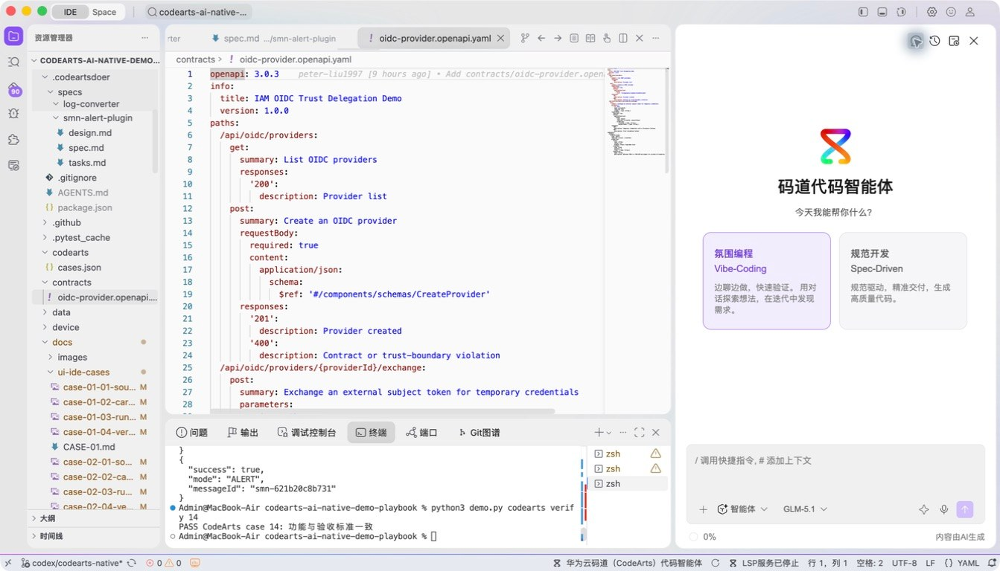
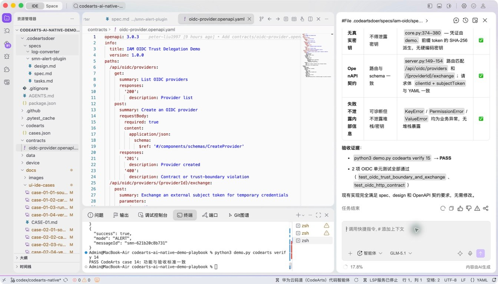
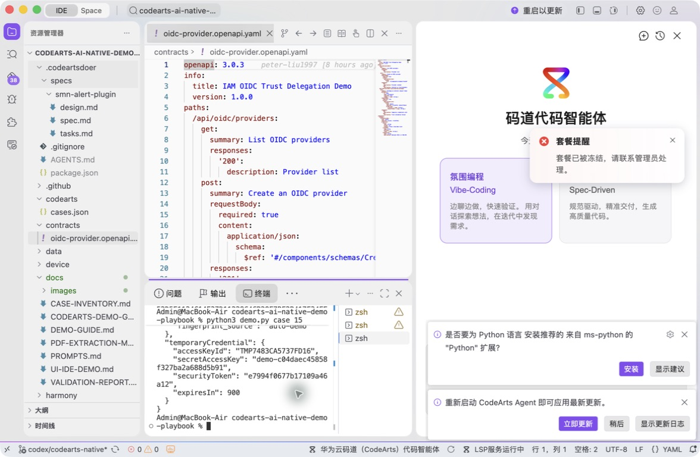
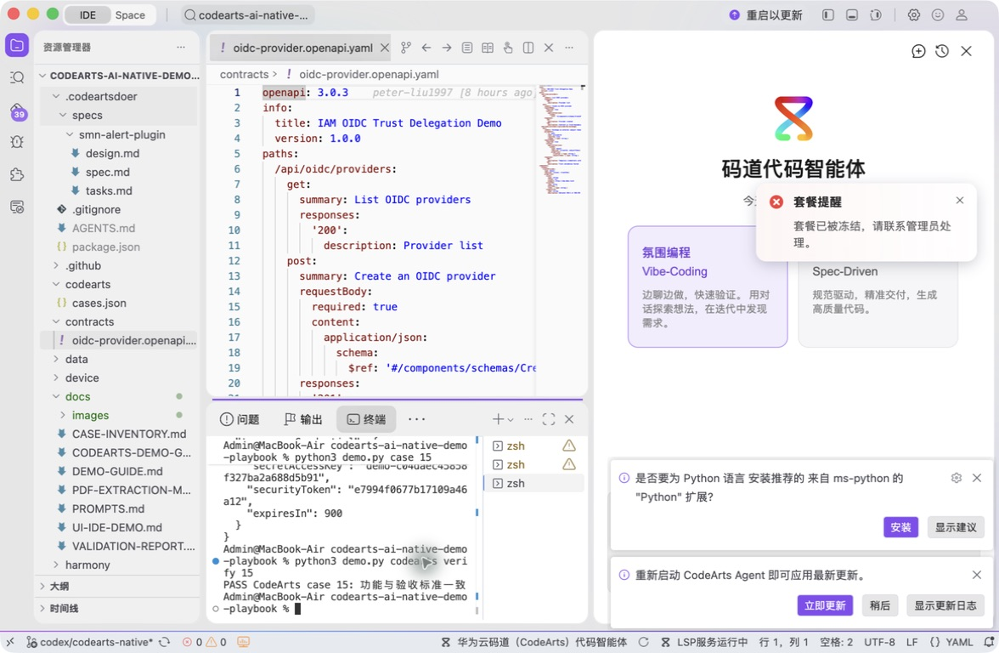

# 案例 15：IAM OIDC 信任委托

[返回 20 案例截图索引](../UI-IDE-CASE-SCREENSHOTS.md)

## 项目背景

- 业务场景：IAM 需要提供 OIDC 身份提供商信任委托接口，支持配置发行方、客户端标识和证书指纹。
- 原始痛点：该类安全接口若忽略 URL、指纹和标识校验，可能引入错误信任或 SSRF；只覆盖成功路径远远不够。
- 演示目标与边界：用 OpenAPI 契约和规范驱动实现本地模拟，不接入真实 IAM，也不保存真实租户或身份凭证。

## 本案例使用的码道能力

| 维度 | 内容 |
|---|---|
| 工作模式 | 规范驱动模式（Spec-Driven），适合高安全、高合规接口。 |
| 关键上下文 | `#File .codeartsdoer/specs/oidc-provider/spec.md`、`design.md`、`tasks.md`、`#File contracts/oidc-provider.openapi.yaml`、相关真实符号。 |
| 智能工程动作 | 从契约生成实现约束，补齐 issuer、client ID、证书指纹以及网络目标的安全校验和反向用例。 |
| 验证与治理 | 对不可信输入默认保守失败，覆盖 SSRF 与错误指纹等负向场景；案例不接触真实凭证。 |
| 客户价值 | 展示码道把接口契约、安全设计和测试串成可审计的云服务开发流程。 |

本页截图来自本案例独立启动的 CodeArts Agent IDE 操作。主文件：`contracts/oidc-provider.openapi.yaml`。

## 步骤 1：打开主文件

查看接口契约。

## 步骤 2：码道案例卡

核对 Spec-Driven 安全上下文。

## 步骤 3：实际运行

创建 Provider 并交换演示临时凭证。

## 步骤 4：独立验收

确认 HTTPS、Client ID 和 SSRF 边界。

完成后确认没有遗留案例服务器；Web 案例必须先 `Ctrl+C`，再执行独立验收。
