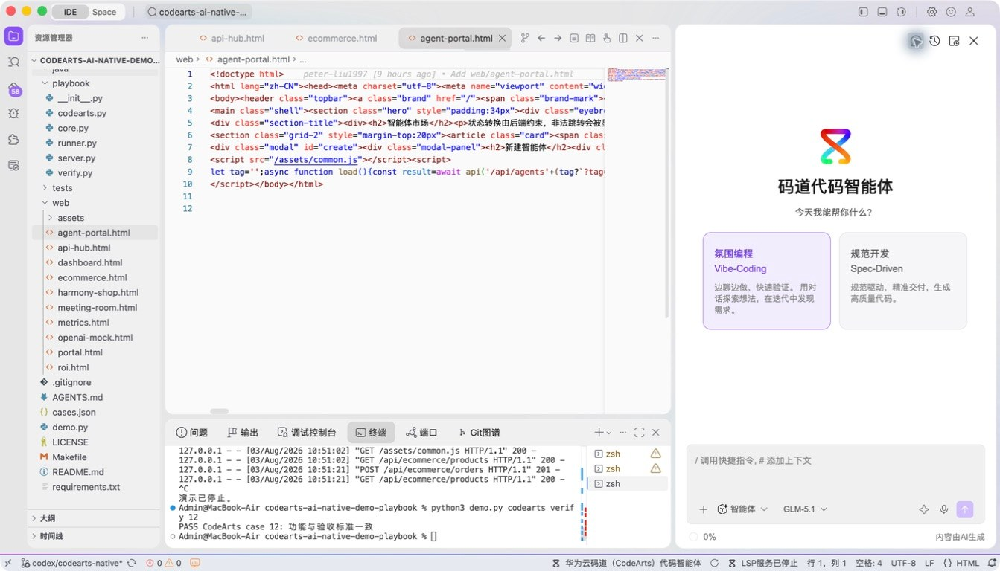
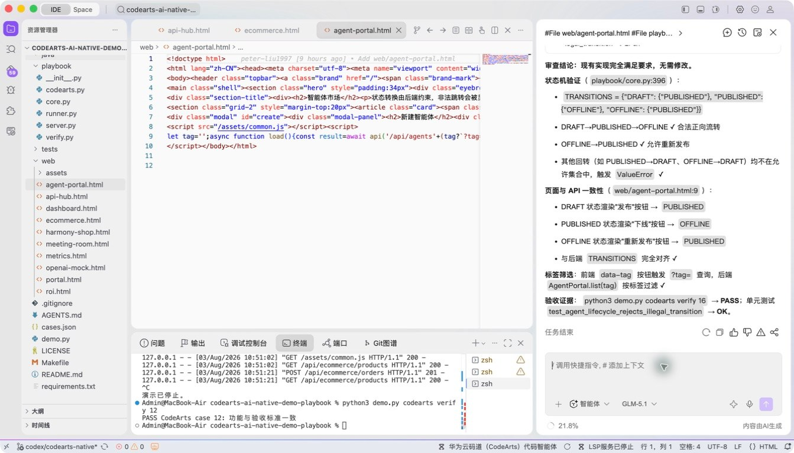
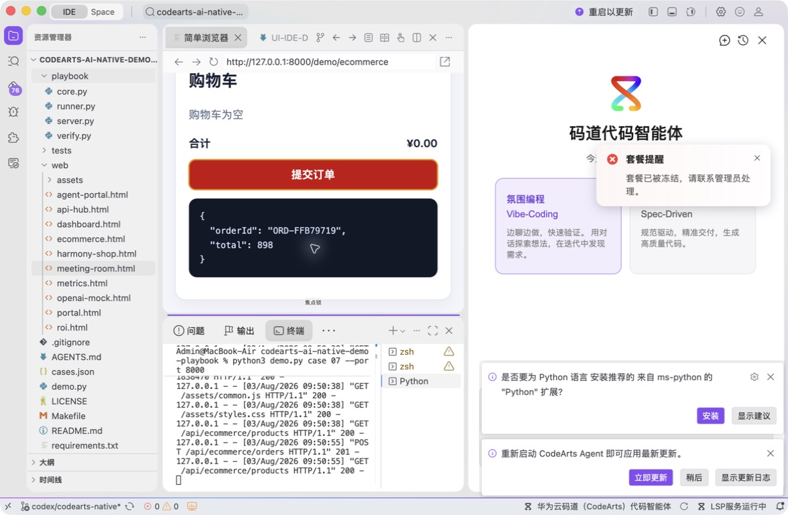
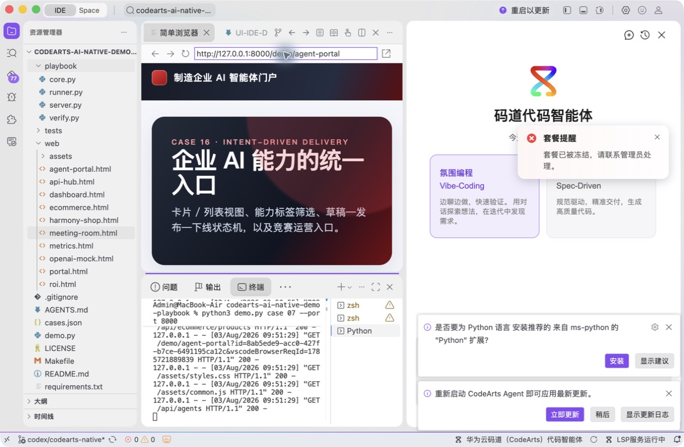
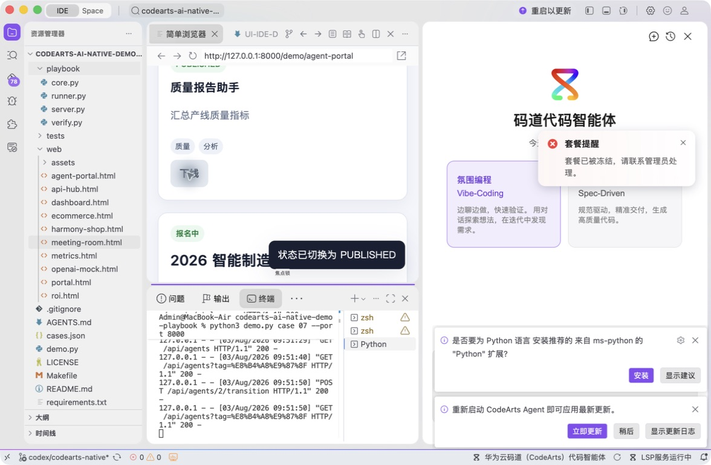
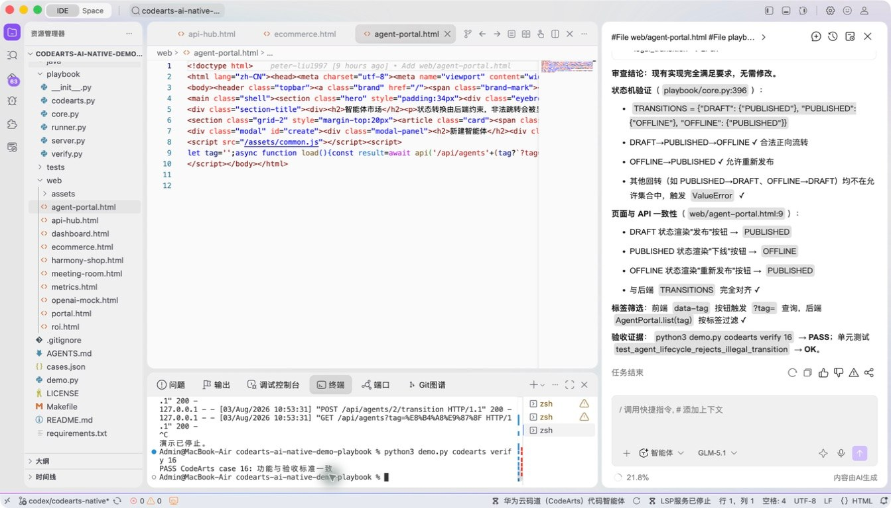

# 案例 16：制造企业 AI 智能体门户

[返回 20 案例截图索引](../UI-IDE-CASE-SCREENSHOTS.md)

## 项目背景

- 业务场景：制造企业希望建设内部 AI 智能体门户，让员工发布、发现、下线智能体，并支持场景赛活动。
- 原始痛点：零文档创意容易漏掉字段、生命周期、角色权限和活动规则，最终只做出展示页面而非业务闭环。
- 演示目标与边界：从模糊想法共同推导 `DRAFT/PUBLISHED/OFFLINE` 生命周期和端到端页面；身份与权限仅做本地模拟。

## 本案例使用的码道能力

| 维度 | 内容 |
|---|---|
| 工作模式 | 探索模式（Vibe-Coding），面向创新场景进行产品与工程共创。 |
| 关键上下文 | `#File web/agent-portal.html`、`#File playbook/server.py`、`#Symbol AgentPortal`、`#File tests/test_playbook.py`。 |
| 智能工程动作 | 从业务意图补齐字段、筛选、生命周期和前后端交互，并形成可操作的场景赛入口。 |
| 验证与治理 | 仅允许定义的状态迁移，验证发布、下线、筛选及异常请求；生产 RBAC 不在本地 Mock 范围内。 |
| 客户价值 | 展示码道在需求尚不完整时推动业务建模，并迅速交付可评审原型。 |

本页截图来自本案例独立启动的 CodeArts Agent IDE 操作。主文件：`web/agent-portal.html`。

## 步骤 1：打开主文件

检查页面入口。

## 步骤 2：码道案例卡

核对生命周期与服务端上下文。

## 步骤 3：启动专用服务

单独启动案例 16 服务。

## 步骤 4：内置浏览器初始状态

在 Simple Browser 打开智能体市场。

## 步骤 5：完成页面交互

筛选“质量”并发布草稿智能体。

## 步骤 6：独立验收

停止服务器并确认案例级验收 PASS。

完成后确认没有遗留案例服务器；Web 案例必须先 `Ctrl+C`，再执行独立验收。
