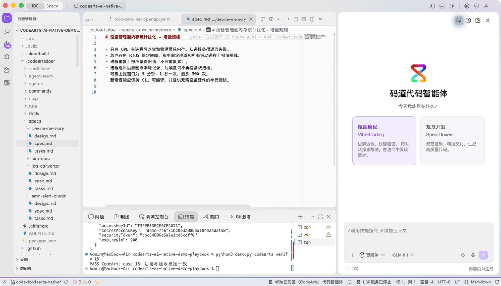
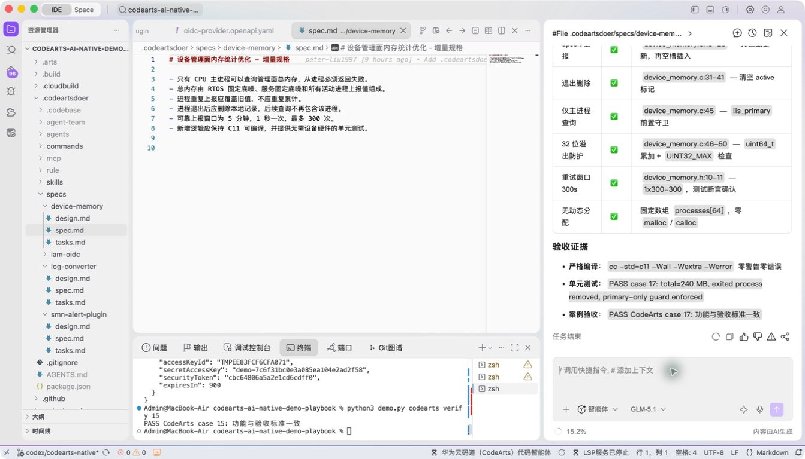
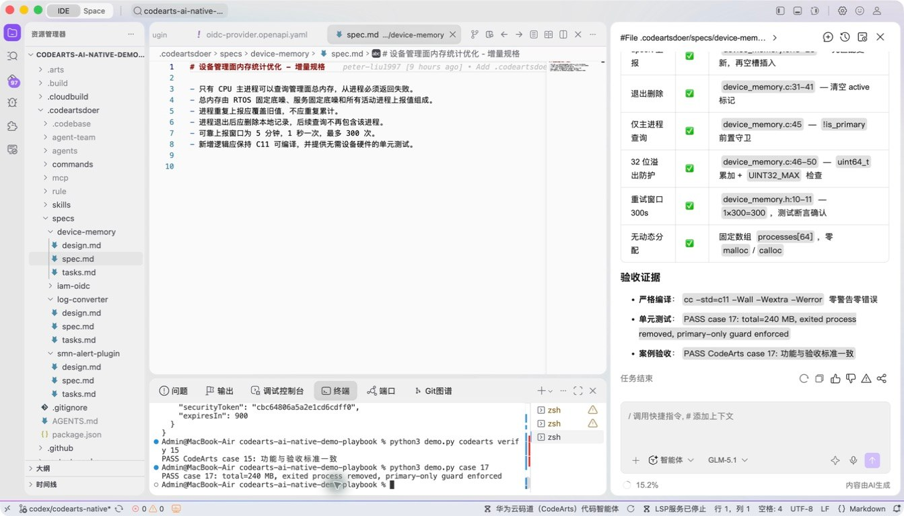

# 案例 17：设备管理面内存统计优化

[返回 20 案例截图索引](../UI-IDE-CASE-SCREENSHOTS.md)

## 项目背景

- 业务场景：设备管理面需要在资源受限的 C 环境中统计内存占用，并正确处理新增、更新、删除和容量上限。
- 原始痛点：固定内存、整数溢出、进程退出清理、`main` 守卫和重试等约束容易在局部优化中被破坏。
- 演示目标与边界：按 C11 规范实现无动态分配的示例并通过严格编译；案例仅模拟设备统计逻辑，不运行真实固件。

## 本案例使用的码道能力

| 维度 | 内容 |
|---|---|
| 工作模式 | 规范驱动模式（Spec-Driven），用于锁定底层系统的性能与安全边界。 |
| 关键上下文 | `#File .codeartsdoer/specs/device-memory/spec.md`、`design.md`、`tasks.md`、`#File c/device_memory.c`、`#File tests/test_device_memory.py`。 |
| 智能工程动作 | 分阶段建立领域接口，补全 upsert、删除、容量保护和主程序守卫，并依据编译错误修复实现。 |
| 验证与治理 | 使用 `-Wall -Wextra -Werror` 严格编译，覆盖溢出、清理和 300 次更新等边界。 |
| 客户价值 | 展示码道在低级语言和领域约束下进行跨文件实现、编译反馈和规范验收。 |

本页截图来自本案例独立启动的 CodeArts Agent IDE 操作。主文件：`.codeartsdoer/specs/device-memory/spec.md`。

## 步骤 1：打开主文件

检查设备内存规格。

## 步骤 2：码道案例卡

核对 C 实现和测试上下文。

## 步骤 3：实际运行

运行 C11 严格编译和设备内存测试。

## 步骤 4：独立验收

确认案例级验收 PASS。

完成后确认没有遗留案例服务器；Web 案例必须先 `Ctrl+C`，再执行独立验收。
