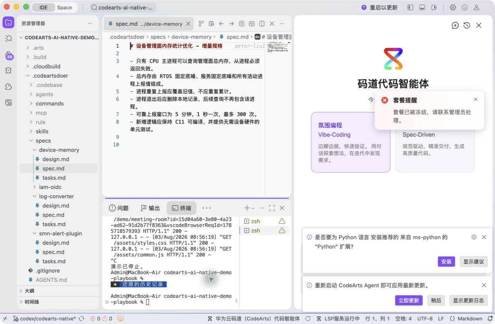
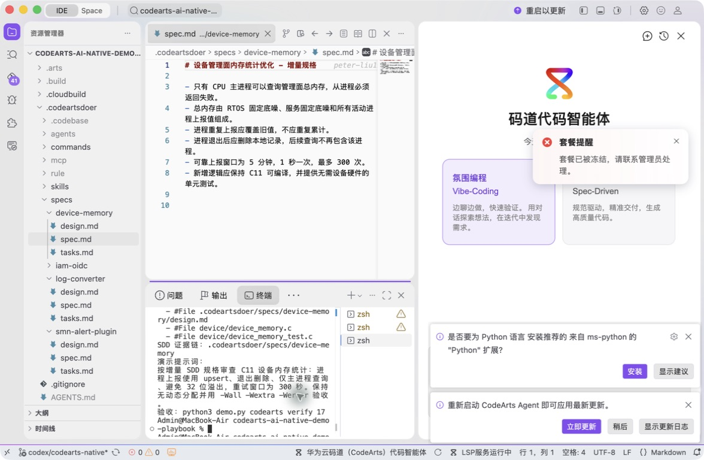
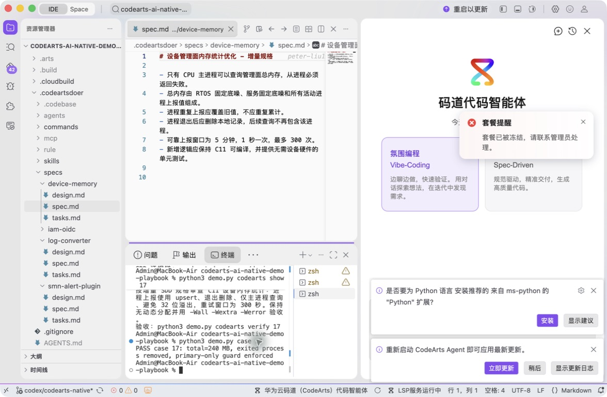

# 案例 17：设备管理面内存统计优化

[返回 20 案例截图索引](../UI-IDE-CASE-SCREENSHOTS.md)

本页截图来自本案例独立启动的 CodeArts Agent IDE 操作。主文件：`.codeartsdoer/specs/device-memory/spec.md`。

## 步骤 1：打开主文件

检查设备内存规格。

## 步骤 2：码道案例卡

核对 C 实现和测试上下文。

## 步骤 3：实际运行

运行 C11 严格编译和设备内存测试。

## 步骤 4：独立验收

确认案例级验收 PASS。

完成后确认没有遗留案例服务器；Web 案例必须先 `Ctrl+C`，再执行独立验收。

