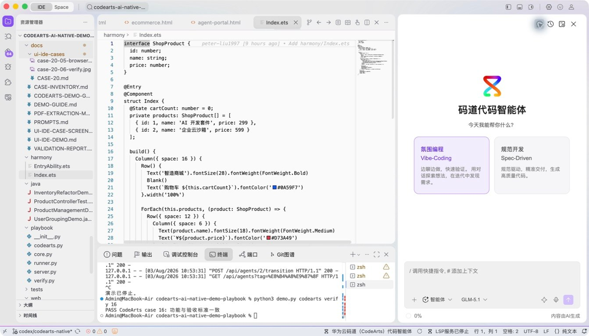
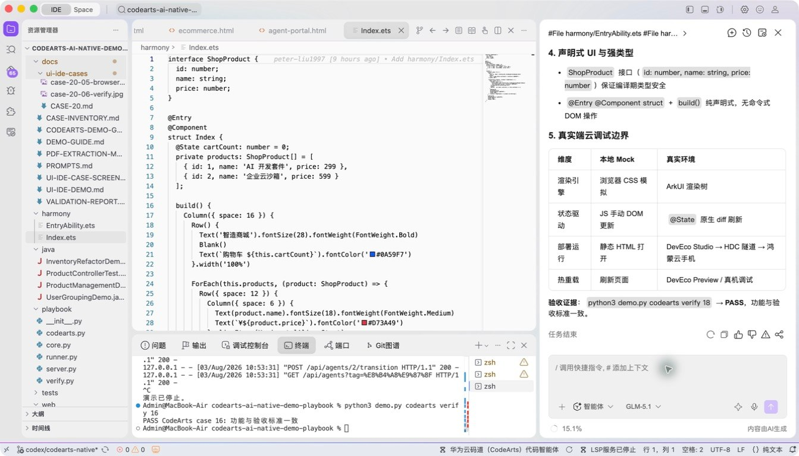
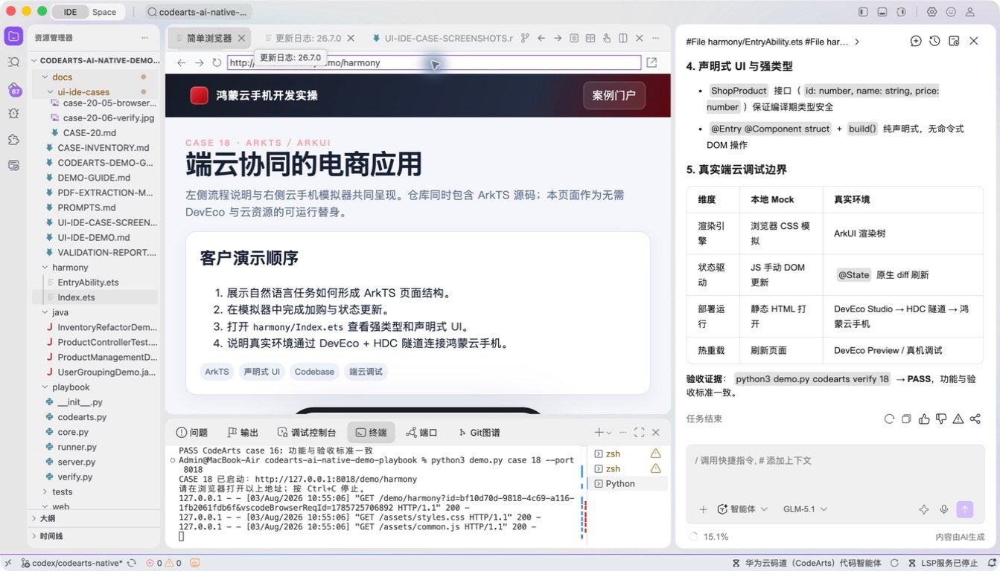
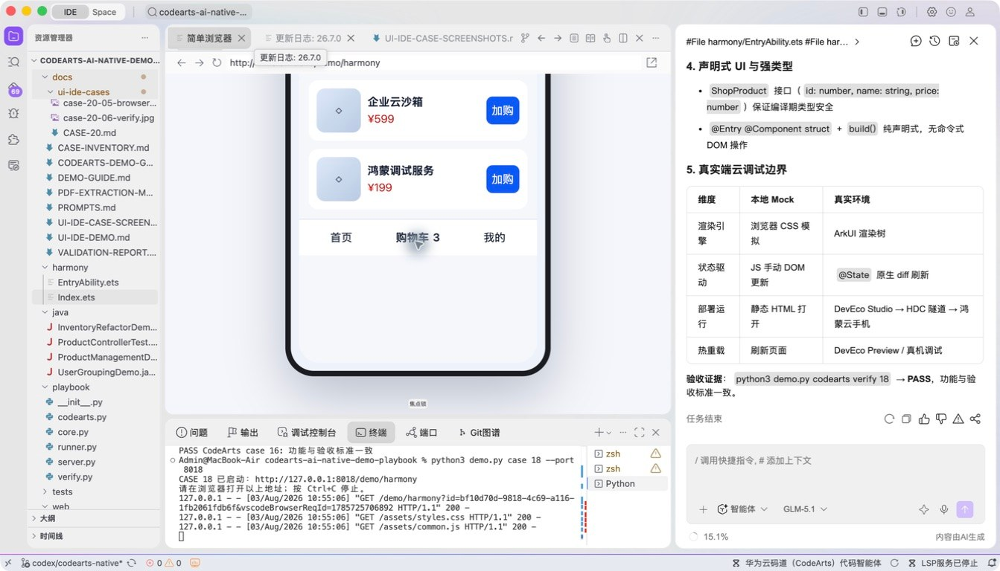
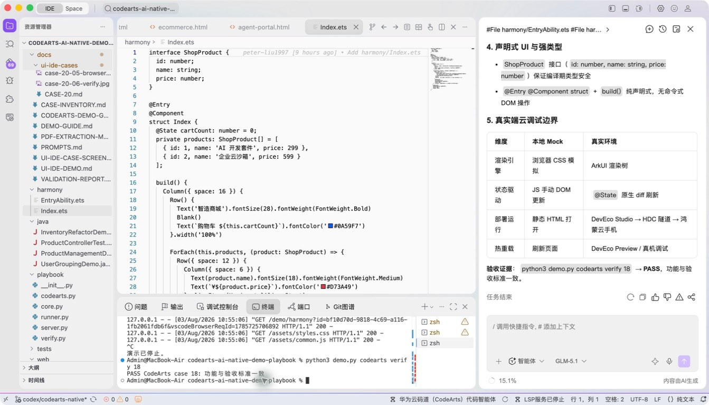

# 案例 18：鸿蒙云手机电商应用

[返回 20 案例截图索引](../UI-IDE-CASE-SCREENSHOTS.md)

## 项目背景

- 业务场景：团队希望快速验证鸿蒙云手机上的电商界面，并形成 ArkTS 页面、Ability 入口和可对照的 Web 原型。
- 原始痛点：对 ArkTS、ArkUI 和 Ability 生命周期不熟悉时，容易生成类型不一致、状态不响应或跨文件引用断裂的代码。
- 演示目标与边界：交付可审阅的 ArkTS 工程片段及本地 Web 替代演示；当前环境不含 DevEco/HDC，不宣称已在真机部署。

## 本案例使用的码道能力

| 维度 | 内容 |
|---|---|
| 工作模式 | 探索模式（Vibe-Coding），用于学习型开发和新生态快速试制。 |
| 关键上下文 | `#File harmony/EntryAbility.ets`、`#File harmony/Index.ets`、`#File web/harmony-shop.html`。 |
| 智能工程动作 | 结合类型和声明式 UI 约束生成 `@State` 交互，处理 Ability 与页面跨文件关系，并提供 Web 对照实现。 |
| 验证与治理 | 在缺少 DevEco 的环境中明确采用本地静态检查和 Web 交互验证；真实云手机/HDC 操作须另行授权。 |
| 客户价值 | 展示码道帮助团队快速进入新技术栈，并协调端、云与替代验证路径。 |

本页截图来自本案例独立启动的 CodeArts Agent IDE 操作。主文件：`harmony/Index.ets`。

## 步骤 1：打开主文件

查看 ArkTS、@State 和 ArkUI 结构。

## 步骤 2：码道对话与结果

核对 ArkTS、Ability 和 Web 替身上下文。 检查码道的上下文读取、分析过程、命令证据和验收结论。

## 步骤 3：启动专用服务

单独启动案例 18 服务。

## 步骤 4：内置浏览器初始状态

在 Simple Browser 打开云手机离线替身。

## 步骤 5：完成页面交互

连续加购三件商品并确认购物车为 3。

## 步骤 6：独立验收

停止服务器并确认案例级验收 PASS。

完成后确认没有遗留案例服务器；Web 案例必须先 `Ctrl+C`，再执行独立验收。
