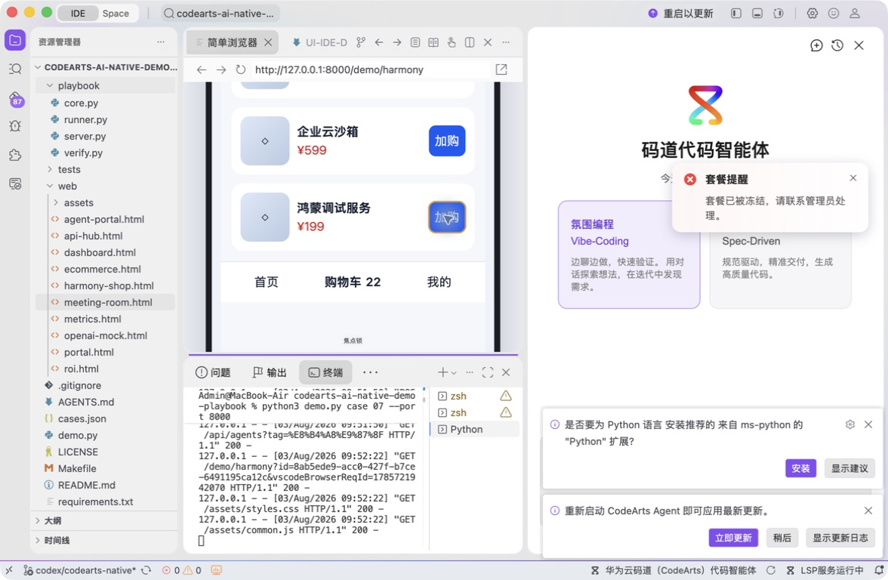
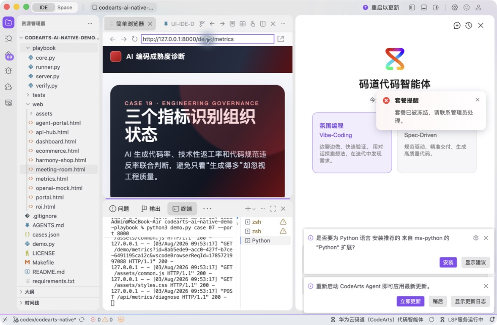
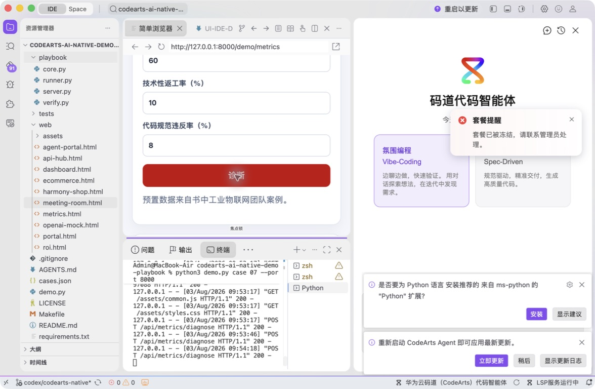
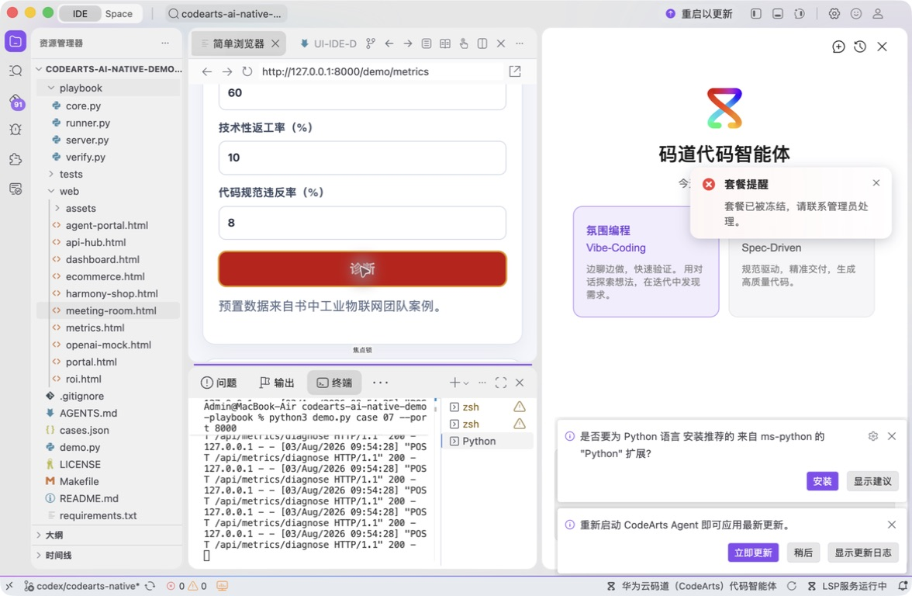

# 案例 19：AI 编码成熟度指标诊断

[返回 20 案例截图索引](../UI-IDE-CASE-SCREENSHOTS.md)

本页截图来自本案例独立启动的 CodeArts Agent IDE 操作。主文件：`web/metrics.html`。

## 步骤 1：打开主文件

检查指标页面入口。

## 步骤 2：码道案例卡

核对指标、诊断符号和测试上下文。

## 步骤 3：启动专用服务

单独启动案例 19 服务。

## 步骤 4：内置浏览器初始状态

查看预置 68/31/27 诊断。

## 步骤 5：完成页面交互

输入 60/10/8 并确认“进化成熟期”。

## 步骤 6：独立验收

停止服务器并确认案例级验收 PASS。

完成后确认没有遗留案例服务器；Web 案例必须先 `Ctrl+C`，再执行独立验收。

