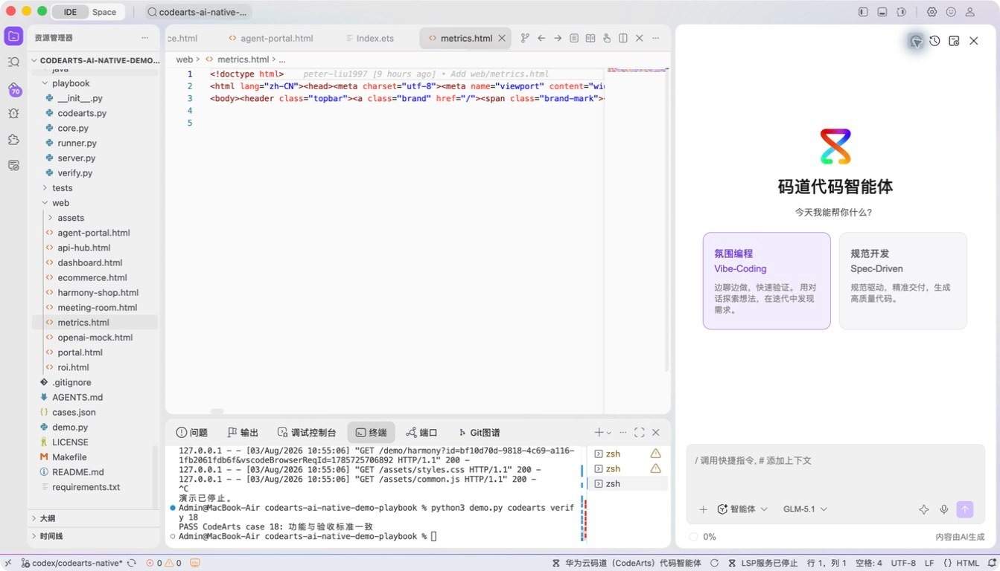
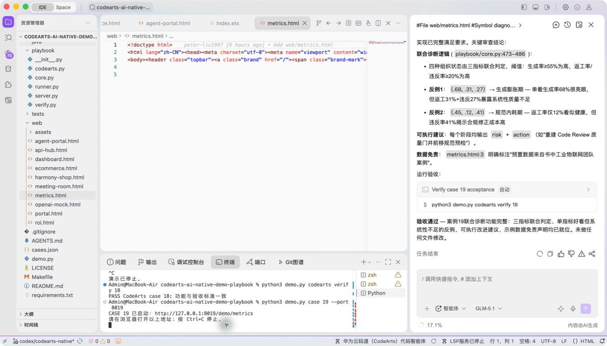
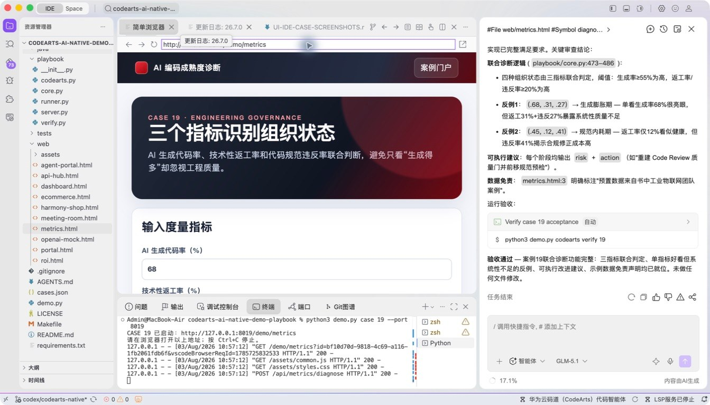
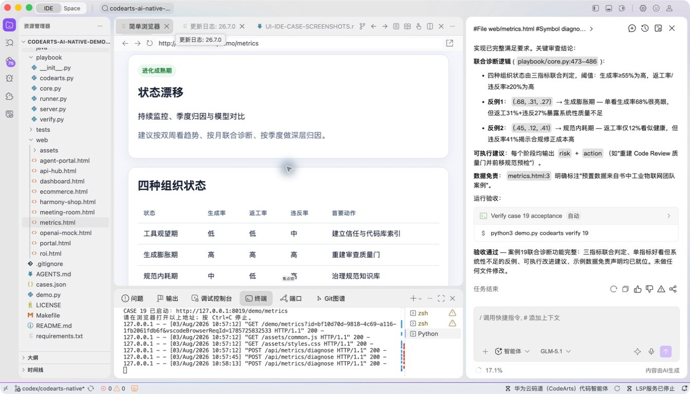
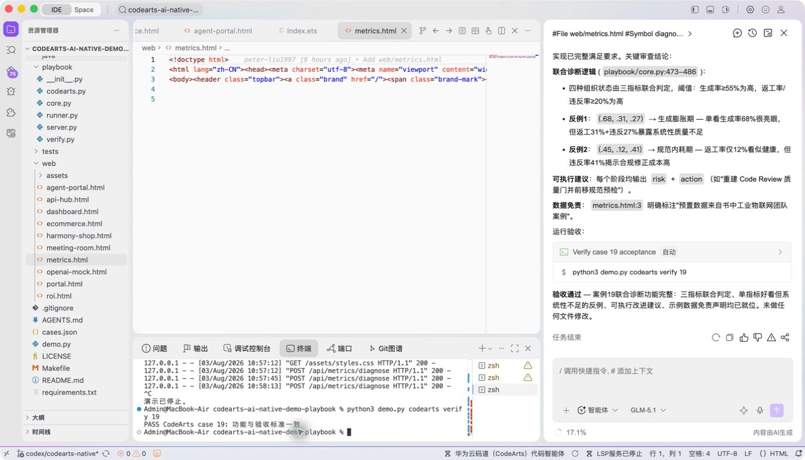

# 案例 19：AI 编码成熟度指标诊断

[返回 20 案例截图索引](../UI-IDE-CASE-SCREENSHOTS.md)

## 项目背景

- 业务场景：研发负责人希望诊断团队 AI 编码成熟度，识别采用率、验收质量和工程治理之间的短板。
- 原始痛点：只看代码生成率等“虚荣指标”可能鼓励错误行为，无法回答质量、交付周期和风险是否真正改善。
- 演示目标与边界：使用联合指标和情景数据输出成熟度、风险与改进动作；结果仅作诊断演示，不用于个人绩效评价。

## 本案例使用的码道能力

| 维度 | 内容 |
|---|---|
| 工作模式 | 探索模式（Vibe-Coding），通过调整场景参数共同探索治理方案。 |
| 关键上下文 | `#File web/metrics.html`、`#Symbol diagnose_maturity`、`#File tests/test_playbook.py`。 |
| 智能工程动作 | 解释真实诊断符号，将计算逻辑呈现为交互看板，并生成风险说明和改进建议。 |
| 验证与治理 | 用多组输入验证等级边界和建议逻辑，明确指标不得单独用于评价个人。 |
| 客户价值 | 展示码道把工程数据转化为可讨论、可行动的研发治理洞察。 |

本页截图来自本案例独立启动的 CodeArts Agent IDE 操作。主文件：`web/metrics.html`。

## 步骤 1：打开主文件

检查指标页面入口。

## 步骤 2：码道对话与结果

核对指标、诊断符号和测试上下文。 检查码道的上下文读取、分析过程、命令证据和验收结论。

## 步骤 3：启动专用服务

单独启动案例 19 服务。

## 步骤 4：内置浏览器初始状态

查看预置 68/31/27 诊断。

## 步骤 5：完成页面交互

输入 60/10/8 并确认“进化成熟期”。

## 步骤 6：独立验收

停止服务器并确认案例级验收 PASS。

完成后确认没有遗留案例服务器；Web 案例必须先 `Ctrl+C`，再执行独立验收。
