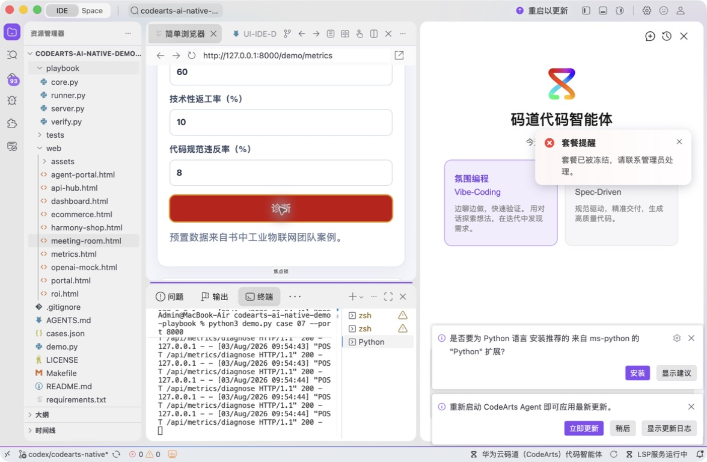
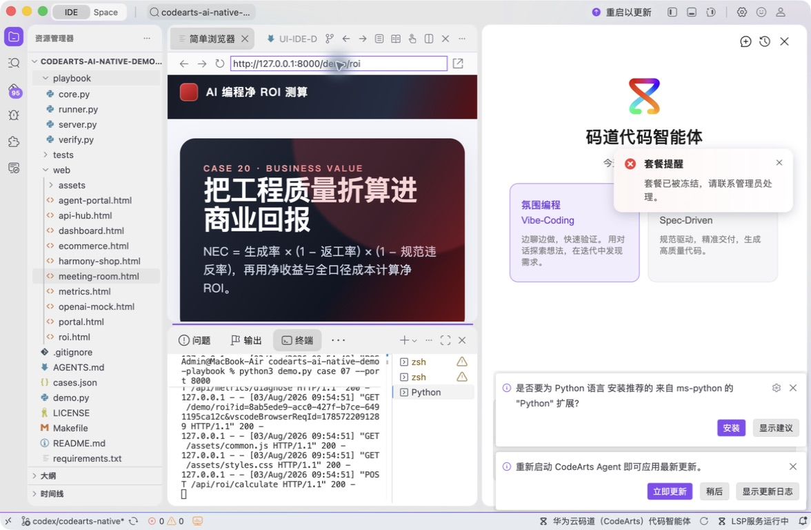
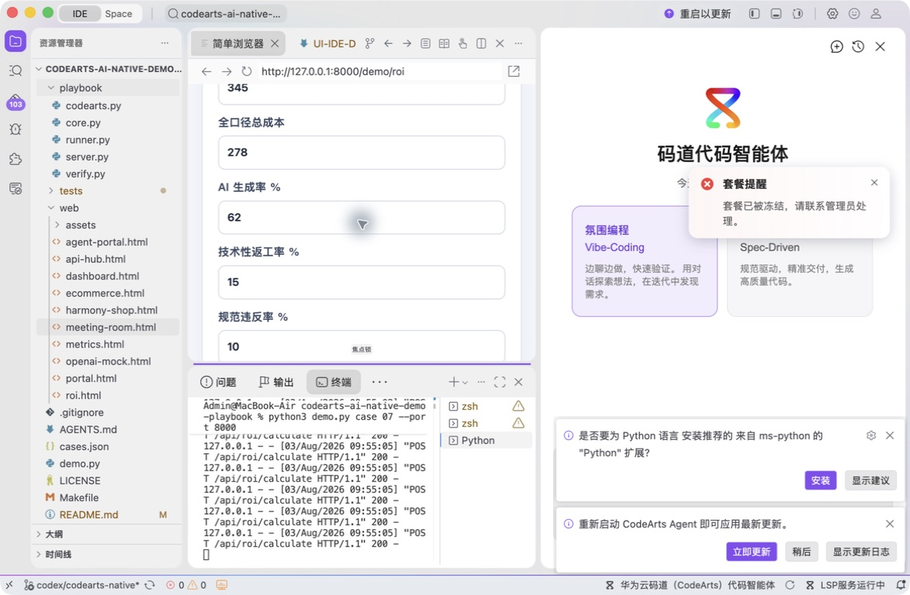
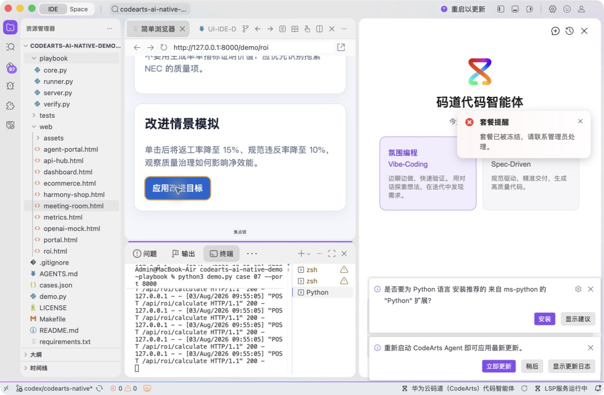

# 案例 20：AI 编程净 ROI 测算

[返回 20 案例截图索引](../UI-IDE-CASE-SCREENSHOTS.md)

本页截图来自本案例独立启动的 CodeArts Agent IDE 操作。主文件：`web/roi.html`。

## 步骤 1：打开主文件

检查 ROI 页面入口。

## 步骤 2：码道案例卡

核对 ROI、NEC 和测试上下文。

## 步骤 3：启动专用服务

单独启动案例 20 服务。

## 步骤 4：内置浏览器初始状态

查看书中预置数据和初始负 ROI。

## 步骤 5：完成页面交互

应用改进目标并观察 NEC 与净 ROI。

## 步骤 6：独立验收

停止服务器并确认案例级验收 PASS。

完成后确认没有遗留案例服务器；Web 案例必须先 `Ctrl+C`，再执行独立验收。

