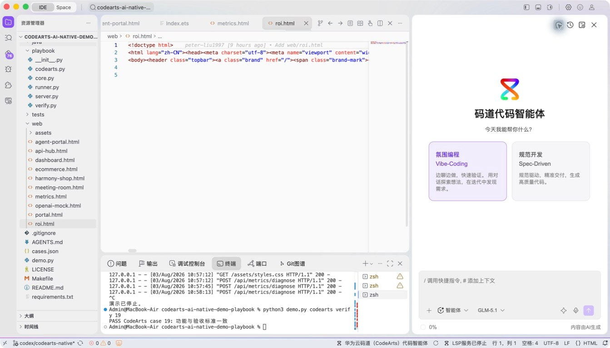
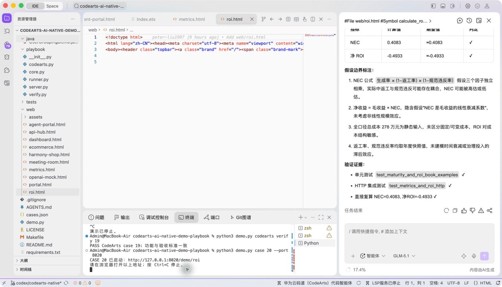
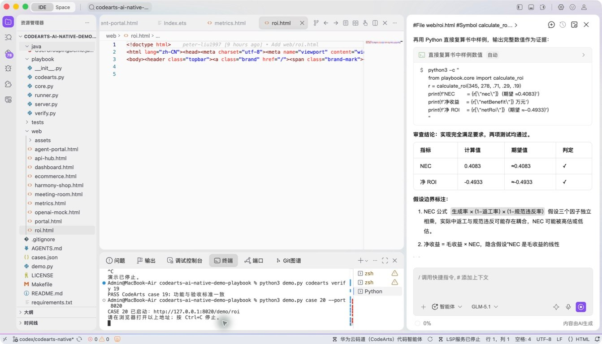
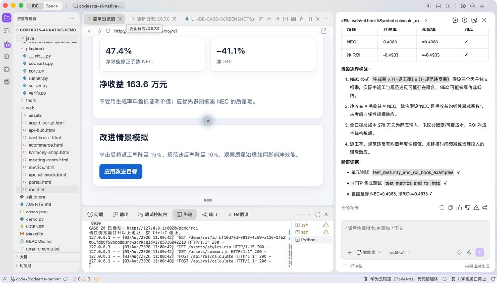

# 案例 20：AI 编程净 ROI 测算

[返回 20 案例截图索引](../UI-IDE-CASE-SCREENSHOTS.md)

## 项目背景

- 业务场景：解决方案团队和研发管理者需要量化 AI 编程投入，向决策者说明净经济贡献和投资回收水平。
- 原始痛点：只计算节省工时会高估收益，若不扣除质量返工、平台费用和采用成本，ROI 结论缺乏决策价值。
- 演示目标与边界：用透明公式和可调参数演示净经济贡献（NEC）与 ROI；输入为假设场景，不构成客户财务承诺。

## 本案例使用的码道能力

| 维度 | 内容 |
|---|---|
| 工作模式 | 探索模式（Vibe-Coding），通过多轮参数调整验证商业假设。 |
| 关键上下文 | `#File web/roi.html`、`#Symbol calculate_roi`、`#File tests/test_playbook.py`。 |
| 智能工程动作 | 检查计算公式，生成可交互测算页，并组织基准、乐观和保守情景对比。 |
| 验证与治理 | 用固定基准校验 NEC≈`0.4083`、ROI≈`-0.4933`，并在页面上显式展示口径与假设。 |
| 客户价值 | 展示码道不仅辅助编码，也能把工程效率与财务决策模型连接起来。 |

本页截图来自本案例独立启动的 CodeArts Agent IDE 操作。主文件：`web/roi.html`。

## 步骤 1：打开主文件

检查 ROI 页面入口。

## 步骤 2：码道对话与结果

核对 ROI、NEC 和测试上下文。 检查码道的上下文读取、分析过程、命令证据和验收结论。

## 步骤 3：启动专用服务

单独启动案例 20 服务。

## 步骤 4：内置浏览器初始状态

查看书中预置数据和初始负 ROI。

## 步骤 5：完成页面交互

应用改进目标并观察 NEC 与净 ROI。

## 步骤 6：独立验收

停止服务器并确认案例级验收 PASS。

完成后确认没有遗留案例服务器；Web 案例必须先 `Ctrl+C`，再执行独立验收。
